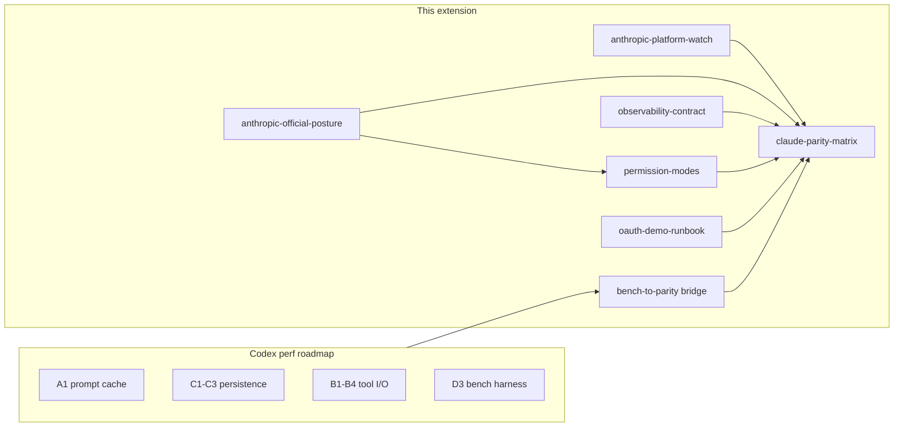
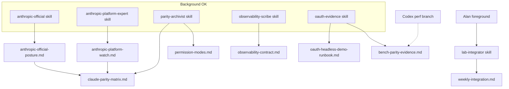

# Beyond Performance Parity — Parity Lab-Notes Extension

## Coordination boundary (do not duplicate Codex)

**Codex owns** the attached [Performance Parity Roadmap](harness_hardening_roadmap_332cb5c9.plan.md) on branch `claude/magical-edison-7Qou6`: phases **A1–A3, B1–B4, C1–C3, D1–D3** in [`src/runner/run.js`](src/runner/run.js), [`context-compactor.js`](src/runner/context-compactor.js), [`session-store.js`](src/runner/session-store.js), [`tool-registry.js`](src/runner/tool-registry.js), [`permissions.js`](src/runner/permissions.js), [`coordinator.js`](src/runner/coordinator.js), and [`test/runner/bench/turn-latency.bench.js`](test/runner/bench/turn-latency.bench.js).

**This plan owns** everything that turns perf + harness code into **credible Claude Code / Agent SDK parity documentation**—primarily under [`lab-notes/parity/`](lab-notes/parity/) and related observability contracts—plus the **minimum runner hooks** needed to fill parity tables with evidence (not new perf features).

**Explicitly out of scope here:**

- [`lab-notes/PROMOTION_RITUAL.md`](lab-notes/PROMOTION_RITUAL.md) execution or canonical `claude-local-bridge` porting
- New bridge-feature work ([`src/credentials.js`](src/credentials.js), [`src/proxy.js`](src/proxy.js), [`src/server.js`](src/server.js), [`src/interceptors/**`](src/interceptors/)). The exception is already-documented OAuth-only hardening: API-key fallback must stay disabled, `/v1/debug` must stay locally gated, and captured tokens must stay redacted.
- Re-litigating safety invariants (shell hidden, write confirmation, redaction)



---

## Current baseline (playground today)

[`lab-notes/HARNESS_VISION.md`](lab-notes/HARNESS_VISION.md) already has a **gap table** (section B). Much runner scaffolding exists (session store, ledger, compaction, coordinator, agent profiles, hooks, memory modules) with contract tests under [`test/runner/`](test/runner/).

**Gap:** vision is ideation; **no maintained parity program** with adopt/skip/later decisions, evidence links, or version-stamped comparisons to `claude -p` / Agent SDK.

[`lab-notes/CHAOS_ORCHESTRATION.md`](lab-notes/CHAOS_ORCHESTRATION.md) workstream **Parity** (section 2) lists the artifacts to create—this plan implements that slice.

---

## Dedicated doc lanes (recommended — create now)

**Yes — create a small set of dedicated lanes**, but **not six** and **not runner `WorkerRuntime` subagents**. For this docs phase, you want **Cursor-side lanes** (skills + charters) that match [`CHAOS_ORCHESTRATION.md`](lab-notes/CHAOS_ORCHESTRATION.md) section 4: Multitask for parallel _thinking_, one owner per file tree, weak isolation.

### What not to create

| Avoid                                     | Why                                                                                                             |
| ----------------------------------------- | --------------------------------------------------------------------------------------------------------------- |
| Six full CHAOS workstream chats           | Overkill while deliverables are 7 markdown files; merge conflicts on `lab-notes/`                               |
| Runner child processes (`explore` worker) | Code orchestration; [`coordinator.js`](src/runner/coordinator.js) already has workers — irrelevant to lab-notes |
| Bridge / perf agents                      | Codex owns perf; bridge is out of scope unless you open a separate lane                                         |
| “Canonical promotion” agent               | Explicitly deprioritized per your direction                                                                     |

### Recommended: six project skills + one index

Store **repeatable prompts** as Cursor **project skills** (`.cursor/skills/<name>/SKILL.md`) so any chat can invoke them; store human-readable lane map in [`lab-notes/agents/README.md`](lab-notes/agents/README.md).



| Lane                     | Skill folder                           | Owns                                                                                                                                                       | May edit                                                                                                                                               | Must not                                                    |
| ------------------------ | -------------------------------------- | ---------------------------------------------------------------------------------------------------------------------------------------------------------- | ------------------------------------------------------------------------------------------------------------------------------------------------------ | ----------------------------------------------------------- |
| **Anthropic official**        | `.cursor/skills/anthropic-official/`        | [`anthropic-official-posture.md`](lab-notes/parity/anthropic-official-posture.md); **feeds** matrix policy columns (proposals only — parity archivist merges) | `lab-notes/parity/anthropic-official-posture.md`, `lab-notes/policy/**` if needed                                                                      | Runner/bridge code; present rumor as fact; evasion guidance |
| **Anthropic platform expert** | `.cursor/skills/anthropic-platform-expert/` | [`anthropic-platform-watch.md`](lab-notes/parity/anthropic-platform-watch.md); **feeds** matrix technical/SDK/API columns (proposals only)                  | `lab-notes/parity/anthropic-platform-watch.md` only                                                                                                    | Runner/bridge code; duplicate policy tables from official lane |
| **Parity archivist**          | `.cursor/skills/parity-archivist/`          | `lab-notes/parity/claude-parity-matrix.md`, `permission-modes.md`, `structured-output.md`                                                                  | `lab-notes/parity/**` except `anthropic-official-posture.md` and `anthropic-platform-watch.md` while those lanes own v1                                | `src/**` code, bridge files, `npm test`                     |
| **Observability scribe** | `.cursor/skills/observability-scribe/` | `lab-notes/observability/observability-contract.md`, stub for `merged-trace-replay.md`                                                                     | `lab-notes/observability/**`, read [`kernel/contract.js`](src/runner/kernel/contract.js), [`output-format.test.js`](test/runner/output-format.test.js) | Bridge traces implementation                                |
| **OAuth evidence**       | `.cursor/skills/oauth-evidence/`       | `oauth-headless-demo-runbook.md`, `bench-parity-evidence.md`                                                                                               | `lab-notes/parity/oauth*`, `bench*`                                                                                                                    | Imply API-key demos; edit `credentials.js`                  |
| **Lab integrator**       | `.cursor/skills/lab-integrator/`       | `weekly-integration.md`, cross-links, optional README blurb                                                                                                | `lab-notes/weekly-integration.md`, index sections                                                                                                      | Rewrite other lanes’ artifacts without Alan                 |

**Shared charter block** (paste into every skill + [`lab-notes/agents/README.md`](lab-notes/agents/README.md)):

```text
Playground only: /Users/alanman/Developer/claude-local-bridge-playground
Current direction: OAuth-only evidence harness for Alan's Anthropic policy conversation.
Do not restore ANTHROPIC_API_KEY, claudeLocalBridge.apiKey, or upstream x-api-key auth.
Do not edit bridge/auth/proxy files unless Alan explicitly asks; if asked, preserve OAuth-only auth, debug-token gating, and token redaction.
Do not run localhost:11437, live Anthropic calls, or npm test unless Alan explicitly asks.
Output: lab-notes markdown only unless Alan asks for code.
Return ≤200 word summary + paths changed; link full artifact, do not paste it.
North star: parity lab-notes for Claude Code / Agent SDK — not canonical promotion.
Read first: lab-notes/OAUTH_ONLY_DIRECTION.md, AGENTS.md, README.md.
```

### Cursor Multitask usage (Alan)

- Rename chats to match lanes: `Anthropic official`, `Parity archivist`, `Observability scribe`, etc.
- **Foreground:** integrator pass after each lane; first read of matrix v1; policy-sensitive rows after official posture v1
- **Background:** **anthropic-official** and **anthropic-platform-expert** in parallel (policy vs technical docs + project-scoped public status); parity archivist seeds matrix from [`HARNESS_VISION.md`](lab-notes/HARNESS_VISION.md) + both posture docs; observability scribe event inventory from tests
- **One file owner rule:** only one lane edits a given path per session (per [`OPENCODE.md`](OPENCODE.md))

### Deliverable 0 — Agent index (do with docs)

**Create:** [`lab-notes/agents/README.md`](lab-notes/agents/README.md) — table of lanes, owned paths, skill paths, foreground/background guidance (short copy of section above).

**Create:** six `.cursor/skills/*/SKILL.md` files with `description` tuned for discovery (including `anthropic-platform-expert`).

**Success metric:** starting a new Cursor chat with “use parity-archivist skill” produces matrix edits without re-explaining playground boundaries; “use anthropic-official skill” produces dated citations for Terms/policy/X claims; “use anthropic-platform-expert skill” produces dated citations for SDK/API/docs and project-scoped public status.

---

## Deliverable 0b — Anthropic official posture snapshot (P0 — feeds matrix)

**Create:** [`lab-notes/parity/anthropic-official-posture.md`](lab-notes/parity/anthropic-official-posture.md)

**Owner lane:** `.cursor/skills/anthropic-official/` (run **before** parity archivist fills “Claude Code” / “Agent SDK” columns in the matrix).

**Purpose:** Single source of truth for **what Anthropic says officially** vs **what the playground implements** — especially Pro/Max subscription scope, OAuth vs API key, `claude -p` / Agent SDK / “interactive mode,” and any **public** policy communications (including X posts). Supports [`letter-to-anthropic-v2.md`](letter-to-anthropic-v2.md) with cited facts, not advocacy.

**Required sections:**

| Section                       | Content                                                                                                                                                                                                                         |
| ----------------------------- | ------------------------------------------------------------------------------------------------------------------------------------------------------------------------------------------------------------------------------- |
| **Doc index**                 | Links + “last checked” date for: Anthropic API reference (Messages, prompt caching, OAuth), Claude Code docs (headless, permissions, hooks), Agent SDK docs (sessions, subagents, stream events), Consumer Terms / Usage Policy |
| **Subscription vs API**       | Table: Pro/Max subscription entitlements vs API/console billing — what docs and Terms say is allowed for third-party clients, headless, automation                                                                              |
| **Interactive mode**          | How Anthropic defines or implies “interactive” vs programmatic use in public materials (quote + URL + date)                                                                                                                     |
| **Agent SDK surface**         | Canonical list of SDK capabilities Alan cares about for parity rows (resume, fork, permission modes, structured output, telemetry) with doc anchors                                                                             |
| **Public communications log** | Chronological appendix: official blog posts, changelog entries, **X.com posts from @Anthropic / @claudeai** (or executives when policy-relevant) — each entry: date, URL, one-line summary, “still current?” Y/N/unclear        |
| **Open questions**            | Ambiguous or conflicting public statements → matrix rows marked `blocked` until clarified                                                                                                                                       |
| **Internal repo cross-refs**  | Pointers only (no duplication): [`deep-research-report.md`](deep-research-report.md), [`lab-notes/claude-code-issues-synthesis.md`](lab-notes/claude-code-issues-synthesis.md)                                                  |

**Research rules (encode in skill):**

- Prefer **primary sources**: `docs.anthropic.com`, `github.com/anthropics/*` official READMEs, anthropic.com legal/Terms, verified X accounts.
- Use **web search** or **OpenAI docs MCP** / **ctx7** when executing (live docs beat training data); cap ~3 lookup commands per task unless Alan asks for deep dive.
- Every policy claim needs **date + URL**; label “rumor” vs “documented” vs “Alan’s private correspondence” (correspondence summarized, not pasted).
- **Must not:** recommend ToS evasion, fingerprint spoofing, or “how to hide” usage; frame as parity and policy clarity for good-faith dialogue.
- **May cite** June 15–style subscription changes only when found in official or dated public sources (do not invent wording).

**Handoff to parity archivist:** Official lane ends with a **“Matrix seed rows”** subsection (bullet list: capability → official stance → citation) for archivist to paste into [`claude-parity-matrix.md`](lab-notes/parity/claude-parity-matrix.md).

**Success metric:** matrix policy columns cite `anthropic-official-posture.md` section anchors; Alan can answer “what does Anthropic say on policy today?” without re-searching X.

---

## Deliverable 0c — Anthropic platform watch (P0 — feeds matrix technical columns)

**Create:** [`lab-notes/parity/anthropic-platform-watch.md`](lab-notes/parity/anthropic-platform-watch.md)

**Owner lane:** `.cursor/skills/anthropic-platform-expert/` (run **in parallel with** official posture; **before** parity archivist fills technical “Claude Code” / “Agent SDK” / Messages API columns).

**Purpose:** Technical source of truth for Agents SDK, Claude API / Messages API, official doc anchors, changelogs, and **project-scoped** public status (X, support articles, GitHub releases) as they affect bridge/runner parity — without duplicating policy tables from deliverable 0b.

**Required sections:**

| Section | Content |
| ------- | ------- |
| **Doc index (technical)** | Dated links: Messages API, prompt caching, OAuth on API, Agent SDK (sessions, subagents, stream events, structured output, telemetry), Claude Code headless/permissions/hooks |
| **API vs SDK vs Claude Code map** | Same capability across Messages API, Agent SDK, `claude -p` with doc anchors |
| **Bridge/runner relevance** | Rows tying docs to OAuth bridge transport, OpenAI-compat surface, runner parity targets, June 15 SDK credit (official cite only) |
| **Changelog / release watch** | Official changelogs and `anthropics/*` GitHub releases |
| **Public status log** | Project-scoped X/official posts: date, URL, summary, still current?, relevance to harness |
| **Open technical gaps** | Ambiguous docs → matrix `blocked` rows |
| **Cross-refs** | Link official posture, detection-risk doc, letter-to-anthropic — no policy duplication |

**Handoff to parity archivist:** Platform lane ends with **“Matrix seed rows (technical)”** (capability → doc stance → doc anchor → open question).

**Success metric:** matrix “Agent SDK” and Messages API columns cite `anthropic-platform-watch.md` anchors; Alan can answer “what do the docs say about X?” for this project without re-searching.

---

## Deliverable 1 — Parity matrix (P0)

**Create:** [`lab-notes/parity/claude-parity-matrix.md`](lab-notes/parity/claude-parity-matrix.md)

**Structure (one row per capability):**

| Column                    | Purpose                                                                                                                                                  |
| ------------------------- | -------------------------------------------------------------------------------------------------------------------------------------------------------- |
| Capability                | e.g. session resume, stream-json events, permission modes, subagents                                                                                     |
| Claude Code (`claude -p`) | Official behavior / doc reference                                                                                                                        |
| Agent SDK                 | Library equivalent (if any)                                                                                                                              |
| Playground runner         | What [`bin/local-bridge-runner.js`](bin/local-bridge-runner.js) + [`bin/local-bridge-coordinator.js`](bin/local-bridge-coordinator.js) actually do today |
| Status                    | adopt / skip / later / blocked                                                                                                                           |
| Evidence                  | CLI flag, test file, or lab command                                                                                                                      |
| Perf note                 | Pointer to Codex item if relevant (A1, C1, etc.)                                                                                                         |

**Seed rows from** [`HARNESS_VISION.md`](lab-notes/HARNESS_VISION.md) section B (30+ rows), then refine with code reads:

- Kernel contract: [`src/runner/kernel/contract.js`](src/runner/kernel/contract.js) (`STOP_REASONS`, `KERNEL_EVENT_TYPES`)
- Coordinator phases: [`src/runner/coordinator.js`](src/runner/coordinator.js) (serial today; Codex **D1** = parallel)
- Resume path: [`session-store.js`](src/runner/session-store.js) + [`session-ledger.js`](src/runner/session-ledger.js) vs deprecated transcript resume in [`run.js`](src/runner/run.js)

**Success metric:** Alan can answer “what are we parity-with vs intentionally not?” in one page without reading source.

---

## Deliverable 2 — Permission mode mapping (P1)

**Create:** [`lab-notes/parity/permission-modes.md`](lab-notes/parity/permission-modes.md)

**Map Claude Code named modes** to playground flags and implementation sites:

| Claude Code concept          | Runner surface           | Code anchor                                                                                    |
| ---------------------------- | ------------------------ | ---------------------------------------------------------------------------------------------- |
| Default / ask                | interactive confirmation | [`confirmation.js`](src/runner/confirmation.js), [`permissions.js`](src/runner/permissions.js) |
| Plan                         | `--plan`                 | [`run.js`](src/runner/run.js) plan branch                                                      |
| Auto-accept edits            | `--accept-edits`         | permissions + parallel writes (Codex **B3**)                                                   |
| Dont-ask (bounded)           | `--dont-ask`             | must not enable shell alone                                                                    |
| Explore / implement profiles | `--agent <profile>`      | [`agents/registry.js`](src/runner/agents/registry.js)                                          |

Include **explicit non-goals:** no Anthropic auto-classifier “YOLO” mode ([`CHAOS_ORCHESTRATION.md`](lab-notes/CHAOS_ORCHESTRATION.md) Detection workstream).

**Success metric:** flag soup in CLI help maps to a single parity table with “equivalent / partial / missing.”

---

## Deliverable 3 — Observability & stream-json contract (P0 for measurability)

**Create:** [`lab-notes/observability/observability-contract.md`](lab-notes/observability/observability-contract.md)

**Contents:**

1. **Event catalog** — every `stream-json` / event-bus type the runner emits vs Claude Code event types (gap list).
2. **Terminal run shape** — required fields on success: `stopReason`, `usage`, `sessionId`, `steps`, correlation to bridge trace `runId`.
3. **Loop autopsy linkage** — how [`loop-autopsy.js`](src/runner/loop-autopsy.js) fields map to “ping-pong / duplicate tool / token slope” ([`test/runner/loop-autopsy.test.js`](test/runner/loop-autopsy.test.js)).
4. **Merged trace story (doc only)** — field mapping runner JSONL ↔ bridge JSONL for future [`merged-trace-replay.md`](lab-notes/observability/merged-trace-replay.md); no HTML tool required in v1.

**Minimal runner hook (only if matrix needs it):** document existing `--trace-level`, `--output-format stream-json`, and [`human-log.js`](src/runner/human-log.js) in the contract; add a **single** `stream-json` golden fixture test only if an event is undocumented today ([`test/runner/output-format.test.js`](test/runner/output-format.test.js) as starting point).

---

## Deliverable 4 — Bench results → parity evidence (bridge doc)

**Create:** [`lab-notes/parity/bench-parity-evidence.md`](lab-notes/parity/bench-parity-evidence.md)

**Depends on Codex landing D3** ([`test/runner/bench/turn-latency.bench.js`](test/runner/bench/turn-latency.bench.js)).

**Template sections:**

- How to run stub vs `--live` (OAuth-only narrative: record `credentialSource` from locked `GET /v1/debug` in preamble with `x-claude-local-bridge-debug-token`; no API key in demo runs)
- Metrics to record: `req_mean_ms`, `req_p95_ms`, `cache_control.mean_breakpoints_per_request`, live `cache_read_input_tokens` ratio
- **Before/after table** placeholder for Codex Tier 1 (C1–C3, A2–A3) and Tier 2 (A1)
- **Parity claim discipline:** bench proves _runner overhead_; live cache ratio proves _Anthropic feature usage_—not “identical to Claude Code” by itself

**Success metric:** perf work becomes falsifiable in parity docs, not orphan numbers in a script.

---

## Deliverable 5 — Structured output parity spike (P2)

**Create:** [`lab-notes/parity/structured-output.md`](lab-notes/parity/structured-output.md)

**Scope:** design-only unless trivial—document how Claude Code / SDK enforce JSON schema on final answers; compare to runner’s text/`stream-json` today. Optional future: `--output-schema <file>` + one re-prompt on validation failure.

**No implementation required** for v1 unless matrix marks it “adopt” after review.

---

## Deliverable 6 — OAuth headless demonstration runbook (parity evidence, not promotion)

**Create:** [`lab-notes/parity/oauth-headless-demo-runbook.md`](lab-notes/parity/oauth-headless-demo-runbook.md)

Supports your Anthropic policy conversation ([`letter-to-anthropic-v2.md`](letter-to-anthropic-v2.md)) **without** canonical promotion:

1. Pre-flight: `curl localhost:11437/v1/debug` with `x-claude-local-bridge-debug-token` from the VS Code Output log — require `upstreamAuthMode: bearer`, `credentialSource` ∈ {`keychain`, `intercepted:bearer`, `proxy:bearer`, `credentials-file`, `env:CLAUDE_CODE_OAUTH_TOKEN`}; API keys unset or dummy-local only
2. Golden command: read-only [`bin/local-bridge-runner.js`](bin/local-bridge-runner.js) with `--agent explore`, `--verbose`, `--human-log`, `--trace-level summary`
3. Artifact checklist: debug JSON snapshot, human log path, runner trace, bridge trace correlation note
4. **Blocked-by column:** note bridge cache TTL issue as transport blocker until Codex fixes (runner request reaches bridge—proven by CAPTURE logs)

Links to permission-modes and observability-contract for “non-interactive client” framing.

---

## Deliverable 7 — Weekly integration note (lightweight)

**Create:** [`lab-notes/weekly-integration.md`](lab-notes/weekly-integration.md) (5-line template per [`CHAOS_ORCHESTRATION.md`](lab-notes/CHAOS_ORCHESTRATION.md) section 3)

After each parity lab session: which matrix rows moved, what evidence was captured, what Codex perf item unblocked a claim.

---

## Suggested execution order (Cursor / you; parallel to Codex)

| Week slice | Work                                                                                      | Touches code? |
| ---------- | ----------------------------------------------------------------------------------------- | ------------- |
| 0          | `lab-notes/agents/README.md` + six `.cursor/skills/` lane charters                        | No            |
| 0–1        | `anthropic-official-posture.md` + `anthropic-platform-watch.md` (parallel OK)             | No            |
| 1          | `claude-parity-matrix.md` draft from HARNESS_VISION + code audit + posture + watch seeds  | No            |
| 1          | `permission-modes.md`                                                                     | No            |
| 2          | `observability-contract.md` + optional output-format test gap                             | Maybe 1 test  |
| 2          | `oauth-headless-demo-runbook.md`                                                          | No            |
| 3          | After Codex bench lands: `bench-parity-evidence.md` with real numbers                     | No            |
| 4          | `structured-output.md` + matrix “adopt/skip” pass                                         | No            |
| 4          | `weekly-integration.md` first entry                                                       | No            |

**Runner code changes in this plan:** only if observability contract discovers undocumented `stream-json` events (small test/doc fix). **No** prefetch/test-watcher wiring, **no** promotion ritual, **no** new bridge-feature work. Existing OAuth-only bridge hardening is the baseline, not a competing track.

---

## How this extends the perf roadmap (not replaces it)

| Perf roadmap item       | Parity lab-notes extension                                  |
| ----------------------- | ----------------------------------------------------------- |
| A1 prompt caching       | Matrix row + bench live cache_read ratio evidence           |
| C1–C3 persistence       | Matrix row “resume authority”; demo runbook session-id step |
| B3 parallel writes      | permission-modes + threat-model cross-ref (already in docs) |
| D3 bench                | `bench-parity-evidence.md` template                         |
| D1 parallel coordinator | Matrix row flips from ❌ to ⚠️ when Codex ships             |

---

## Verification (lab-notes program)

- `anthropic-official-posture.md` exists with dated citations for subscription/API/interactive claims
- `anthropic-platform-watch.md` exists with dated technical citations and project-scoped public-status log
- Matrix covers every HARNESS_VISION section B row with status + evidence column filled; policy columns trace to posture doc; technical columns trace to platform watch
- Each “adopt” row has a test file or copy-paste command
- Demo runbook runnable after Codex cache fix (document blocker until then)
- No edits to bridge layer; no canonical promotion checklist

**Optional cross-link:** add one paragraph to [`README.md`](README.md) pointing to `lab-notes/parity/claude-parity-matrix.md` (docs-only, after matrix v1 is stable).
