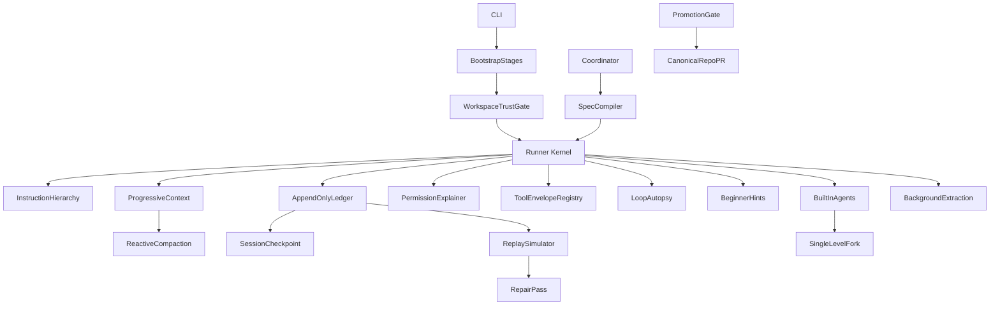

# Harness Hardening Roadmap

## Scope

This plan targets the playground repo at `/Users/alanman/Developer/claude-local-bridge-playground`. It upgrades the current Agent OS scaffold from "working layers" to "measurable runtime contracts."

It includes:

- **Beginner UX (cross-cutting)**: every error, warning, and stop condition must explain what happened, why, and what to try next -- in plain language Alan can act on.
- **P0 security**: workspace trust/consent gate before any tool executes.
- **Table-stakes memory**: instruction file hierarchy (org/user/project/local), four-type auto-memory, two-step save, `/review-memory` workflow, background session extraction.
- **Context engineering**: progressive disclosure for tools/skills, reactive mid-session compaction with real summarize stage.
- **Measurability**: ledger with monotonic sequence numbers, separate replay vs. repair passes, tool envelopes with model-visible recovery pointers, coordinator spec compiler with inspectable synthesis.
- **Safety**: bypass-immune permission severity levels, advisory-only budgets, read-only autopsy, batch fail-fast parallelism, `--chaos-ok` never bypasses path guards.
- **Delegation**: built-in agent profiles, fork-cannot-fork single-level boundary, byte-identical prefix caching, memoized bootstrap stages.
- **Promotion ritual** with six-layer contract test checklist.

It does not extend bridge fingerprint, `cch`, TLS, capture-proxy, or header-mimicry behavior. Those risks should be de-scoped or removed, not made more sophisticated.

## Cross-Cutting: Beginner-Friendly Error UX

**Problem today**: [`run.js`](src/runner/run.js) emits bare `[runner] Bridge error on step 3: ECONNREFUSED` or `Permission denied: ...` with no explanation of what that means or how to fix it. [`human-log.js`](src/runner/human-log.js) records these same terse strings. A beginner sees an error, has no idea what broke, and cannot troubleshoot independently.

This is not a phase -- it is a **design constraint applied to every phase**. Every `console.error`, every `humanLog.writeError`, every stop reason, and every tool result with `ok: false` must pass through a beginner-friendly formatter.

Create `[src/runner/beginner-hints.js](src/runner/beginner-hints.js)`:

- **Error catalog**: a lookup table mapping error patterns (regex or error code) to `{ whatHappened, why, tip, docLink }` tuples.
- **Hint formatter**: `formatHint(errorKey, context)` returns a multi-line string:
  - Line 1: **What happened** -- plain English, no jargon. E.g. "The runner could not connect to the local bridge server."
  - Line 2: **Why** -- one sentence of context. E.g. "The bridge runs as a VS Code extension and must be started before the runner."
  - Line 3: **Tip** -- concrete next action. E.g. "Open VS Code, make sure Claude Local Bridge is installed and running, then try again."
  - Line 4 (optional): **Doc link** -- e.g. "See: docs/runner-quickstart.html#troubleshooting"
- **Integration points** (wired into each phase as it ships):
  - `run.js` catch blocks: bridge ECONNREFUSED, 401/403, 429/503, timeout, malformed response.
  - Permission denials: "You tried to edit .env -- the runner blocks this to protect secrets."
  - Compaction warnings: "The conversation is getting long -- the runner compressed older messages to save space."
  - Trust gate (Phase 0): "This folder hasn't been approved yet. The runner won't touch files until you say it's OK."
  - Ledger crash recovery (Phase 4): "The last run didn't finish cleanly. The runner found X incomplete steps and recovered."
  - Budget warnings (Phase 8): "The run is approaching its token budget. The runner will stop soon to prevent unexpected costs."
  - Stop reasons: every `STOP_REASONS` value gets a catalog entry.
- **Verbose vs. quiet**: hints always show `whatHappened` + `tip`. Verbose mode (`--verbose`) also shows `why` and `docLink`. Quiet mode (`--quiet`) suppresses hints and shows only the raw error.
- **Human log**: `humanLog.writeError(msg)` calls `formatHint` automatically; the log file becomes a troubleshooting diary.
- **Stream JSON**: the `error` event envelope gains `{ hint: { whatHappened, tip } }` for programmatic consumers.

Example error catalog entries (initial set):

- `ECONNREFUSED` on bridge URL: "Bridge not running. Open VS Code with the extension enabled, then retry."
- `401 Unauthorized` from bridge: "Credentials expired. Re-authenticate in VS Code (look for the Claude icon in the status bar)."
- `429 Too Many Requests`: "Rate limited by the API. The runner will wait and retry automatically. If this keeps happening, wait a few minutes."
- `Permission denied: path guard`: "That file is outside the working directory. The runner only touches files inside --cwd. Check that your --cwd path is correct."
- `Permission denied: deny_matrix`: "That file (.env / .ssh / credentials) is on the block list. This protects your secrets from being accidentally read or modified."
- `workspace_not_trusted`: "You haven't approved this folder yet. Run with --trust-workspace or answer 'y' when prompted."
- `max_steps_reached`: "The runner hit its step limit (default 16). You can increase it with --max-steps or ask a more focused question."
- `context_budget_exceeded`: "The conversation used too many tokens. Try a shorter prompt, or use --session-id to start a fresh session."
- `compaction:clip` / `compaction:snip` / `compaction:ghost`: "Older messages were compressed to save space. The model can re-read files if it needs the details again."
- `semantic_cycle_detected`: "The model is repeating the same actions. This usually means it's stuck. Try rephrasing your request or breaking it into smaller steps."
- `bridge_error` with timeout: "The bridge took too long to respond. This sometimes happens with large requests. Try again, or use a smaller --max-tokens value."

**Phase completion gate**: a phase is not done until every new error path has a catalog entry in `beginner-hints.js` and a test that verifies the hint renders without jargon.

Tests:

- `test/runner/beginner-hints.test.js` -- every catalog entry produces expected output, no jargon leaks.

## Implementation Priority

Ship in this order (each slice is independently testable). Beginner UX is not a separate phase -- it is woven into every phase as it ships: **every new error path gets a catalog entry before the phase is considered done**.

1. **Workspace trust gate** -- block tool loop until cwd is consented.
2. **Instruction hierarchy** -- Claude Code parity for layered `AGENTS.md` / `CLAUDE.md`.
3. **Progressive disclosure + reactive compaction** -- shrink every-turn system prompt; compress mid-session.
4. **Ledger + replay** -- measurable continuity with sequence-numbered events.
5. **Envelopes + permission explainer + aliases + cache invalidation**.
6. **Budgets + autopsy** (advisory only; autopsy is read-only).
7. **Parallel reads + shell honesty**.
8. **Coordinator spec compiler + built-in agents + fork/bootstrap**.
9. **Full memory taxonomy + background extraction + hooks**.
10. **Promotion ritual + docs**.

## Architecture Shape



## Phase 0: Workspace Trust Gate (P0)

**Problem today**: [`--trusted-workspace`](bin/local-bridge-runner.js) only gates hooks in [`hook-dispatcher.js`](src/runner/hooks/hook-dispatcher.js). Tools can run on an unreviewed cwd. This is the #1 security gap.

Create `[src/runner/workspace-trust.js](src/runner/workspace-trust.js)`.

Key changes:

- On startup (before first model call or tool dispatch in [`run.js`](src/runner/run.js)), resolve `cwd` realpath and check trust state.
- Trust store: `.bridge-runner/trust.json` under user config or per-workspace record with `{ cwdRealpath, trustedAt, fingerprint }`.
- Interactive first-run consent: show cwd, git root hint, and risk summary; require explicit `y` unless `--trust-workspace` or prior record exists.
- **Fail closed**: if not trusted, deny all tools (including read-only) and stop with `workspace_not_trusted` in [`kernel/contract.js`](src/runner/kernel/contract.js).
- `--trusted-workspace` becomes "this run is trusted" (hooks + auto-memory writes + session extraction); separate from one-time `--trust-workspace` consent recording.
- Non-interactive CI: require `--trust-workspace` flag; never auto-trust unknown paths.
- Ledger event: `workspace_trust_evaluated` with decision metadata.
- **Beginner hint**: "This folder hasn't been approved yet. The runner needs your permission before it can read or change any files here. Type 'y' to approve, or run with --trust-workspace next time."

Tests:

- `test/runner/workspace-trust.test.js`
- Extend permission/safety tests to assert no tool runs pre-trust.

## Phase 1: Instruction File Hierarchy

**Problem today**: [`instruction-memory.js`](src/runner/memory/instruction-memory.js) only loads project-local `AGENTS.md` / `CLAUDE.md` / `OPENCODE.md` from `cwd`. No org/user/local scopes. This is table-stakes for Claude Code parity.

Expand `[src/runner/memory/instruction-memory.js](src/runner/memory/instruction-memory.js)` and wire through [`context-builder.js`](src/runner/context-builder.js).

Discovery order (later overrides earlier):

1. **Org** (optional): `$BRIDGE_RUNNER_ORG_INSTRUCTIONS/` or documented org root.
2. **User**: `~/.bridge-runner/instructions/` and `~/.claude/`-style fallbacks if present (read-only, bounded).
3. **Project**: `cwd` root files (`AGENTS.md`, `CLAUDE.md`, `OPENCODE.md`).
4. **Local**: `cwd/.bridge-runner/instructions/` and nested `AGENTS.local.md` if adopted.

Key changes:

- Return structured blocks: `{ scope, path, priority, chars, hash }` plus concatenated `text` under global `MAX_INSTRUCTION_CHARS`.
- Inject at bootstrap only (memoized per run); emit `instruction_sources` on ledger/trace.
- Never load instruction files outside discovered roots; respect existing path deny matrix.
- Document precedence in [`lab-notes/AGENT_OS_ARCHITECTURE.md`](lab-notes/AGENT_OS_ARCHITECTURE.md) and runner docs.
- **Beginner hint on load**: "Loaded instructions from X files: [list]. These tell the runner how to behave in this project."

Tests:

- `test/runner/instruction-hierarchy.test.js`

## Phase 2: Progressive Context Disclosure

**Problem today**: [`context-builder.js`](src/runner/context-builder.js) embeds **all** tool descriptions in every system prompt. [`tool-registry.getDefinitions`](src/runner/tool-registry.js) exists but is not used for lazy loading. Skills listing from [`skills-index.js`](src/runner/skills/skills-index.js) is appended in full when present.

Create `[src/runner/context-budget.js](src/runner/context-budget.js)`.

Key changes:

- **Tool defs**: default system prompt includes tool _names_ + one-line summaries only; full schemas/descriptions loaded on demand via `describe_tools` meta-tool or turn-scoped expansion when model requests a category (read / write / shell).
- **Skills**: keep lazy index metadata only; load full `SKILL.md` body when activation router matches (Phase 13). Hard-cap discovery listing at ~1% of context window, each entry capped at ~250 chars.
- **Budget**: `--context-budget-chars` (or token estimate) caps instruction + tools + skills sections; truncate with explicit "[budget truncated]" markers.
- **Cache**: memoize built system prompt per `(cwd, allowShell, allowedTools, trust, compactionGeneration)` until invalidation (Phase 6).
- Anthropic API `tools` array still sends full JSON schemas required by the API; separation is **system prompt prose** vs **API tool definitions** (do not double-ship long prose).

Tests:

- `test/runner/context-budget.test.js`
- `test/runner/progressive-tools.test.js`

## Phase 3: Reactive Context Compaction

**Problem today**: [`context-compactor.js`](src/runner/context-compactor.js) runs clip/snip/ghost in [`run.js`](src/runner/run.js) but `summarize` is `summarize_pending` only -- no mid-session summarization of older turns. Predictive budgets (Phase 8) are planned but reactive compression is not explicit.

Key changes:

- **Reactive trigger**: after each turn, if `estimateTokens(messages) >= warnTokens` OR post-tool burst, run compaction ladder automatically (not only at halt).
- **Summarize stage**: implement bounded summarization of oldest preserved turns into a single assistant/user neutral summary block; record `compaction_applied` on ledger with before/after token estimates.
- **Preserve invariants**: never drop orphaned `tool_use` / `tool_result` pairs; replay simulator validates pairs after compaction.
- Coordinate with session `compactionGeneration` in [`session-store.js`](src/runner/session-store.js).
- Optional `--compaction-model` for summarize-only mini calls (off by default in playground).
- **Beginner hint on compaction**: "The conversation is getting long, so the runner compressed some older messages. The model can always re-read files if it needs the details again. This is normal and helps prevent errors."

Tests:

- `test/runner/reactive-compaction.test.js`
- Extend compaction tests for summarize stage and pair integrity.

## Phase 4: Ledger-First Continuity

Create `[src/runner/session-ledger.js](src/runner/session-ledger.js)` as the append-only source of truth. Keep `[src/runner/session-store.js](src/runner/session-store.js)` as a checkpoint/cache, not the primary history.

Key changes:

- **Monotonic sequence numbers**: every event gets `seq: <monotonic>` (write-ahead invariant). On ledger open, read last event's seq. If last event is `_intent` without corresponding `_result`, a crash happened mid-effect -- surface this clearly.
- Add versioned ledger events: `session_started`, `user_prompt`, `model_request`, `assistant_message`, `tool_effect_intent`, `tool_effect_result`, `tool_result_message`, `compaction_applied`, `run_stopped`.
- In [`run.js`](src/runner/run.js), record ledger events around each model/tool boundary.
- For writes/shell, append intent before effect and result after effect.
- Store file hashes, backup paths, undo entries, tool ids, turn numbers, and run ids.
- **Resume order**: ledger first, session checkpoint second. **No transcript fallback for resume** -- if neither ledger nor checkpoint exists, fail with a clear error rather than silently degrading to a lossy transcript. Transcript remains audit-only.
- **Beginner hint on crash recovery**: "The last run didn't finish cleanly. The runner found 3 incomplete steps and recovered from the ledger. Your files are safe -- check the human log for details."

Tests:

- `test/runner/session-ledger.test.js` -- including sequence gap detection.
- Extend `test/runner/resume.test.js`
- Add crash-window tests for pending write intents.
- Test that resume fails cleanly (not silently degrades) when no ledger or checkpoint exists.

## Phase 5: Replay Simulator And Repair (Separate Passes)

Create `[src/runner/replay-simulator.js](src/runner/replay-simulator.js)` and `[src/runner/ledger-repair.js](src/runner/ledger-repair.js)`.

**Design critique applied**: replay and repair are separate concerns. Replay verifies ledger internal consistency (read-only). Repair fixes detected issues (mutating, requires user approval).

Key changes:

- **Replay pass** (read-only): rebuild Anthropic `messages` and runner metadata from ledger without calling the model or tools. Verify sequence number continuity, event type pairing (`intent` matches `result`), checkpoint drift.
- **Repair pass** (separate, mutating): fix orphaned tool results, pending effects, trailing `tool_use` blocks. Requires explicit `--repair` flag and interactive confirmation. Never auto-repair.
- **Transcript migration utility**: one-time converter from old transcript format to ledger. Not a permanent fallback parser -- build it, use it, then deprecate it. Do not harden a fallback that should be eliminated.
- Optional CLI support in [`bin/local-bridge-runner.js`](bin/local-bridge-runner.js): `--replay` (verify only), `--repair` (fix with approval).
- **Beginner hint on replay issues**: "The replay check found some inconsistencies in session X. This usually means a previous run was interrupted. Run with --repair to fix them (the runner will ask before changing anything)."

Tests:

- `test/runner/replay-simulator.test.js`
- `test/runner/ledger-repair.test.js`

## Phase 6: Tool Result Envelopes, Aliases, And Cache Invalidation

Normalize all tool execution through [`tool-registry.js`](src/runner/tool-registry.js).

Envelope shape:

```js
{
  (ok, text, summary, data, bytes, truncated, refreshHint, safetyTags, permission, effect, timing_ms);
}
```

Key changes:

- Anthropic-facing `tool_result.content` remains plain text for compatibility.
- **Recovery pointers in model-visible text**: when `truncated: true`, the `text` field injected into Anthropic's `tool_result.content` must include the recovery pointer inline (e.g. `[Output truncated at X bytes. Run read_file --offset Y to continue.]`). The `refreshHint` is the structured version for runners, but the model must see it too -- otherwise it hallucinates completions of truncated output.
- Stream JSON, traces, transcript, ledger, human logs receive full envelopes.
- Update write tools under [`src/runner/tools/`](src/runner/tools/) to return before/after hashes and backup/effect metadata.
- Ensure `apply_patch` uses the same atomic write and undo pattern as `edit_file` and `write_file`.
- **Tool aliases**: in [`tool-registry.js`](src/runner/tool-registry.js), register backward-compatible names (e.g. `read` -> `read_file`, `write` -> `write_file`) with deprecation notes in envelopes; canonical name used in ledger.
- **Cache invalidation**: invalidate memoized system prompt, skills index, and instruction hash cache at mutation points (write tools, `apply_patch`, trusted hook mutations, compaction generation bump).

Tests:

- `test/runner/tool-envelope.test.js` -- verify recovery pointer is present in model-visible text when truncated.
- `test/runner/tool-aliases.test.js`
- `test/runner/context-cache-invalidation.test.js`
- Extend write/undo/atomic tests.

## Phase 7: Permission Rule Explainer

Extend [`permissions.js`](src/runner/permissions.js) so every decision explains itself.

Decision metadata:

- `decision`: allow, ask, deny, plan_only
- `category`: read-only, write, shell, recovery
- `mode`: default, plan, acceptEdits, dontAsk, acceptEditsAndDontAsk
- `ruleId`: path_guard, deny_matrix, allowed_tools, shell_disabled, mode_policy, session_grant
- `matchedGuards`: path confinement, secret pattern, shell scanner, previous denial
- `explanation`: beginner-readable reason
- **`severity`** (new, from bypass-immune pattern):
  - `hard_deny` -- never auto-approve, always surface, survives any mode (deny matrix paths like `.env`, `.ssh/`)
  - `bypassable_ask` -- can be auto-approved with `--accept-edits`
  - `bypassable_deny` -- can be overridden with an explicit `--allow-path` flag (new CLI option)

Key changes:

- Emit `permission_decision` for both allow and deny, not only approval-required paths.
- Add denial history into session runner state so stateful permission behavior is inspectable.
- Show explanations in stream JSON, trace, ledger, and human log.
- `hard_deny` paths are immune to `--dont-ask`, `--accept-edits`, and `--chaos-ok` -- they always block and always explain why.
- **Beginner hint on deny**: "The runner blocked access to .env because it might contain secrets (API keys, passwords). This is a safety feature that can't be turned off, even with --accept-edits. If you need to edit this file, do it manually outside the runner."

Tests:

- `test/runner/permission-explainer.test.js`
- `test/runner/permission-severity.test.js` -- verify hard_deny survives all bypass flags.
- Extend permission and safety tests.

## Phase 8: Loop Autopsy And Run Budgets

Add a loop health module `[src/runner/loop-autopsy.js](src/runner/loop-autopsy.js)` and budget helpers.

Key changes:

- Add stop reasons in [`kernel/contract.js`](src/runner/kernel/contract.js): `semantic_cycle_detected`, `wall_clock_budget_exceeded`, `cost_budget_exceeded`, `predictive_context_budget_exceeded`, `retry_budget_exceeded`.
- Detect repeated normalized tool calls and repeated result classes.
- **Predictive budget is advisory only**: `estimateTokens` is imprecise (chars / 3.5 for English, chars / 2 for code). The predictive check warns ("approaching budget") but **never blocks a turn based solely on the estimate** -- only on actual counted tokens from the response. Blocking check uses real `usage.input_tokens` from the API response.
- Add `--max-wall-clock-ms` and `--max-cost-usd` to CLI.
- Add model pricing table in `[src/runner/model-pricing.js](src/runner/model-pricing.js)` with clear "estimate only" labeling.
- Separate bridge retry counters from tool failure counters.
- Add exponential backoff and `retry-after` support around bridge 429/503 failures.
- **Autopsy is read-only**: the final `autopsy` event is a read-only analysis pass over the ledger. It writes to the human log and a separate `*.autopsy.json` file, **not** to the ledger itself (avoids infinite loop where autopsy triggers another autopsy).
- **Beginner hints**: "The run stopped because it was repeating the same actions (cycle detected). Try rephrasing your request." / "The run is approaching its token budget. Each step costs approximately $X. Current total: ~$Y."

Tests:

- `test/runner/loop-autopsy.test.js` -- verify autopsy does not write to ledger.
- `test/runner/budget-guards.test.js` -- verify predictive check is advisory, actual check is blocking.
- `test/runner/retry-policy.test.js`

## Phase 9: True Read-Only Parallelism

Convert the current "batched but sequential" read tools in [`run.js`](src/runner/run.js) into real parallel execution.

Key changes:

- Add async dispatch in [`tool-registry.js`](src/runner/tool-registry.js).
- Mark read-only calls as concurrency-safe per call, not just per tool name.
- Run read-only calls with `Promise.allSettled` and preserve original tool result order.
- Keep write, shell, recovery, and uncertain tools serial.
- **Batch fail-fast rule**: do not try to detect argument dependencies between parallel reads (too fragile). Instead, if any tool in a parallel batch fails, annotate the remaining results: "Some reads in this batch may reflect stale state because another read in the same batch failed." This is simpler and honest.
- **Beginner hint**: "The runner is reading multiple files at once to save time. If one read fails, the others still complete, but you may want to re-read them to be safe."

Tests:

- `test/runner/tool-concurrency.test.js`

## Phase 10: Shell And Network Honesty

Improve shell handling without pretending it is a real sandbox.

Key changes:

- Keep shell hidden unless `--allow-shell` is set.
- Add a shell policy scanner in [`safety.js`](src/runner/safety.js) or `[src/runner/shell-policy.js](src/runner/shell-policy.js)`.
- Under `--no-network`, deny obvious network commands instead of relying only on proxy env vars.
- `--chaos-ok` only bypasses the **tool-category permission matrix** (allowing shell + writes + auto-approve together). It **never bypasses path-level safety checks**: shell access targeting `.git/`, `.claude/`, `.ssh/`, or agent config directories is `severity: hard_deny` regardless of `--chaos-ok`.
- Document that this is still not OS sandboxing.
- **Beginner hint**: "You used --chaos-ok, which removes most safety prompts. The runner still blocks access to sensitive files (.env, .ssh, credentials) no matter what flags you set. Be careful with this mode -- it lets the model make changes without asking first."

Tests:

- `test/runner/bash-safety.test.js`
- `test/runner/no-network-policy.test.js`
- `test/runner/chaos-ok-path-guards.test.js` -- verify hard_deny paths survive chaos mode.

## Phase 11: Coordinator Spec Compiler

Replace the string-template `synthesizeSpec()` in [`coordinator.js`](src/runner/coordinator.js) with structured compilation.

Compiled spec fields:

- objective
- constraints
- researchFindings with evidence
- allowedFiles
- taskPlan
- acceptanceChecks
- risks
- openQuestions
- verificationPlan
- **synthesisNotes** (new): where the coordinator explicitly records what it extracted from worker results, what it discarded, and what it inferred. This makes the synthesis step inspectable and prevents the "based on your findings" pass-through anti-pattern.

Key changes:

- Require evidence-bearing worker results from [`worker-runtime.js`](src/runner/worker-runtime.js).
- Reject empty or vague research digests. Also reject pass-through: the coordinator must rewrite findings into implementation instructions, not just forward them.
- Pass the compiled spec into execute phase as a concrete instruction document.
- **Beginner hint**: "The coordinator is building a plan from research results. You can inspect what it kept and discarded in the synthesisNotes field of the spec."

Tests:

- Extend `test/runner/harness-architecture.test.js`
- Add `test/runner/coordinator-spec.test.js` -- verify synthesisNotes is populated and pass-through is rejected.

## Phase 12: Built-In Agents, Fork Pattern, And Bootstrap

Add pre-defined agent roles, cache-optimized child spawns, and ordered initialization.

Key changes:

- Create `[src/runner/agents/registry.js](src/runner/agents/registry.js)`: `explore`, `plan`, `implement`, `verify`, `test`, `replay`, `extractor` (session learning).
- Profile schema: `{ id, description, allowedTools, maxSteps, trustMode, outputSchema, spawnMode, forkAllowed }`.
- Add `--agent <profile>` in [`bin/local-bridge-runner.js`](bin/local-bridge-runner.js).
- **Fork pattern** (extend [`session-store.fork`](src/runner/session-store.js)):
  - Parent passes shared context snapshot: instruction hash, compaction generation, read-only file hints -- not full mutable session.
  - Child runs with isolated `runId`, inherits cwd trust only if parent was trusted.
  - **Fork-cannot-fork**: child agents cannot spawn children (`spawnDepth <= 1`). The fork tool remains in the child's tool pool (for cache alignment with the parent's system prompt) but is **blocked at call time** with a clear error: "Child agents cannot spawn further children. This keeps the system predictable and prevents runaway agent chains."
  - **Byte-identical prefix caching**: when forking, all sibling children share a byte-identical system prompt prefix (instructions, tool definitions, message history, placeholder tool results). Only the final directive block differs per child. Without this, forking is expensive cloning with no cache benefit.
- **Bootstrap memoized stages** in `[src/runner/bootstrap.js](src/runner/bootstrap.js)`:
  1. Parse CLI + validate cwd
  2. Workspace trust gate
  3. Load instruction hierarchy (memoized)
  4. Build progressive context / tool surface
  5. Resume ledger or session
  6. Fast-path dispatch for trivial commands (e.g. `--version`, empty prompt help) -- skip model call entirely
- Structured worker findings: `{ claims, evidencePaths, confidence }`.

Tests:

- `test/runner/agent-profiles.test.js`
- `test/runner/fork-boundary.test.js` -- verify fork-cannot-fork is enforced at call time, not just schema.
- `test/runner/bootstrap-stages.test.js`

## Phase 13: Memory Taxonomy, Two-Step Save, Background Extraction

Complete memory without bypassing safety. **Note**: [`auto-memory.js`](src/runner/memory/auto-memory.js) already implements a two-step save stub but only `type: 'project'` -- expand to full taxonomy.

Key changes:

- **Four-type taxonomy** in auto-memory index: `user`, `feedback`, `project`, `reference` -- each with caps per type and global `INDEX_CAP`.
- **Two-step save invariant** (enforce everywhere): write topic file first, then update index; on failure, leave index unchanged; ledger `memory_write_intent` / `memory_write_result`.
- **Promotion queue**: `.bridge-runner/memory-promotions/` for durable instruction changes -- human or trusted-workspace approval before merging into project `AGENTS.md`.
- **Memory review workflow**: add `/review-memory` command (or `--review-memory` CLI flag) to inspect pending promotions and approve/reject them interactively. Without this, the queue has no consumer.
- **Background session extraction** (profile `extractor`):
  - At session end (or `--extract-after-run`), fork read-only worker over ledger + transcript.
  - Propose typed memory entries; never auto-promote without queue approval.
  - Requires trusted workspace + explicit `--session-extract` flag.
- **Skill activation router** in [`skills-index.js`](src/runner/skills/skills-index.js) + [`context-builder.js`](src/runner/context-builder.js) (pairs with Phase 2 progressive disclosure). Hard-cap skill listing at ~1% of context window.
- **Beginner hint**: "The runner learned something from this session and wants to save it. Run --review-memory to see what it wants to remember and approve or reject each item."

Tests:

- `test/runner/auto-memory-taxonomy.test.js`
- `test/runner/memory-two-step-save.test.js`
- `test/runner/memory-review-workflow.test.js`
- `test/runner/session-extraction.test.js`
- `test/runner/skill-activation.test.js`
- `test/runner/memory-promotion.test.js`

## Phase 14: Hooks (Gated By Trust, Ledger-Relative Timing)

Declarative hooks only; arbitrary shell/JS hooks deferred.

Key changes:

- Hooks require **workspace trust** (Phase 0), not merely a CLI flag on an untrusted cwd.
- Declarative actions first: log, annotate trace, advisory block.
- **Ledger-relative firing order**: a `pre_tool` hook fires after `tool_effect_intent` is appended to the ledger (so the hook can read it). A `post_tool` hook fires after `tool_effect_result` is appended. This ordering matters for crash safety -- the ledger always has the intent before the hook runs.
- Ledger event: `hook_dispatched` with trust state snapshot.

Tests:

- `test/runner/hooks.test.js`
- `test/runner/hook-ledger-ordering.test.js` -- verify hooks see the correct ledger state.

## Phase 15: Async Eviction (Future-Proof)

No async worker pool exists yet. Document and stub two-phase eviction for when background jobs land:

- Phase A: mark job cancelled / stop accepting new work.
- Phase B: drain in-flight, persist partial results to ledger, then tear down.

Add design note in `lab-notes/` only until async work ships; no implementation required in v1.

## Phase 16: Promotion Ritual From Playground To Canonical

Add a documented maturity gate so experiments do not rot.

Create/update:

- `[lab-notes/PROMOTION_RITUAL.md](lab-notes/PROMOTION_RITUAL.md)`
- `[lab-notes/AGENT_OS_ARCHITECTURE.md](lab-notes/AGENT_OS_ARCHITECTURE.md)`
- `[docs/runner-quickstart.html](docs/runner-quickstart.html)`
- `[docs/command-builder.html](docs/command-builder.html)`

Gate:

- experiment spec exists
- contract tests exist
- targeted runner tests pass
- safety/docs updated
- bridge boundary respected
- canonical port plan written
- canonical PR opened only after manual promotion
- **Six-layer contract test checklist**: the promotion gate must demonstrate that each of the six harness layers (memory, skills, tools/safety, context, coordination, lifecycle) is at least partially working. This prevents experiments from slipping through with only one layer functional.

## Gap Coverage Matrix

| Gap identified                                      | Plan phase                  |
| --------------------------------------------------- | --------------------------- |
| Beginner-friendly error UX                          | Cross-cutting (every phase) |
| Workspace trust gate before tools                   | Phase 0                     |
| Instruction file hierarchy (org/user/project/local) | Phase 1                     |
| Progressive disclosure (tools + skills budget)      | Phase 2                     |
| Skill budget-constrained listing                    | Phase 2 + Phase 13          |
| Reactive mid-session compaction + summarize         | Phase 3                     |
| Ledger monotonic sequence numbers                   | Phase 4                     |
| Separate replay vs. repair passes                   | Phase 5                     |
| Transcript migration (not permanent fallback)       | Phase 5                     |
| Recovery pointers in model-visible text             | Phase 6                     |
| Tool aliases for backward compatibility             | Phase 6                     |
| Cache invalidation at mutation points               | Phase 6                     |
| Bypass-immune permission severity levels            | Phase 7                     |
| Advisory-only predictive budgets                    | Phase 8                     |
| Read-only autopsy (no ledger writes)                | Phase 8                     |
| Batch fail-fast for parallel reads                  | Phase 9                     |
| chaos-ok never bypasses path guards                 | Phase 10                    |
| Coordinator synthesisNotes (inspectable synthesis)  | Phase 11                    |
| Fork-cannot-fork single-level boundary              | Phase 12                    |
| Byte-identical prefix caching for forks             | Phase 12                    |
| Bootstrap memoized stages + fast-path               | Phase 12                    |
| Four-type auto-memory + two-step save               | Phase 13                    |
| Memory review workflow (/review-memory)             | Phase 13                    |
| Background session extraction                       | Phase 13                    |
| Hooks with ledger-relative timing                   | Phase 14                    |
| Two-phase async eviction                            | Phase 15 (design only)      |
| Six-layer contract test checklist                   | Phase 16                    |

**Already partial in codebase** (plan now explicit): `context-compactor.js` clip/snip/ghost; `instruction-memory.js` project-only; `auto-memory.js` two-step save with single type; `session-store.fork()` without spawn depth enforcement.

## Verification Plan

Run targeted tests first (priority order):

```bash
node --require ./test/setup.js --test test/runner/beginner-hints.test.js
node --require ./test/setup.js --test test/runner/workspace-trust.test.js test/runner/instruction-hierarchy.test.js
node --require ./test/setup.js --test test/runner/reactive-compaction.test.js test/runner/context-budget.test.js
node --require ./test/setup.js --test test/runner/session-ledger.test.js test/runner/replay-simulator.test.js
node --require ./test/setup.js --test test/runner/*.test.js
```

Then docs/format checks:

```bash
npx prettier --check <touched files>
npm run lint
```

Update [`docs/threat-model.md`](docs/threat-model.md) when Phase 0 ships.

Avoid bridge/gateway smoke tests unless Alan explicitly says `LOCAL SMOKE TEST`.

## Risk Notes

- This is too large for one safe PR. Follow **Implementation Priority** slices; do not skip Phase 0 to chase ledger features.
- Do not make transcript fallback the new source of truth. It should remain audit-only. Phase 5 builds a one-time migration utility, not a permanent fallback.
- Do not strengthen or maintain impersonation/fingerprint machinery. Treat those items as de-risk/remove/de-scope work.
- Progressive disclosure must not strip API `tools` schemas the model needs for valid `tool_use` blocks -- only reduce redundant prose in the system prompt.
- Background extraction must never write durable instruction files without promotion queue approval.
- Predictive budget checks are advisory only -- never block a model turn based solely on a character-based token estimate.
- Autopsy must never write to the ledger (write to separate file to avoid recursion).
- Beginner hints must not leak internal implementation details or file paths outside cwd.
