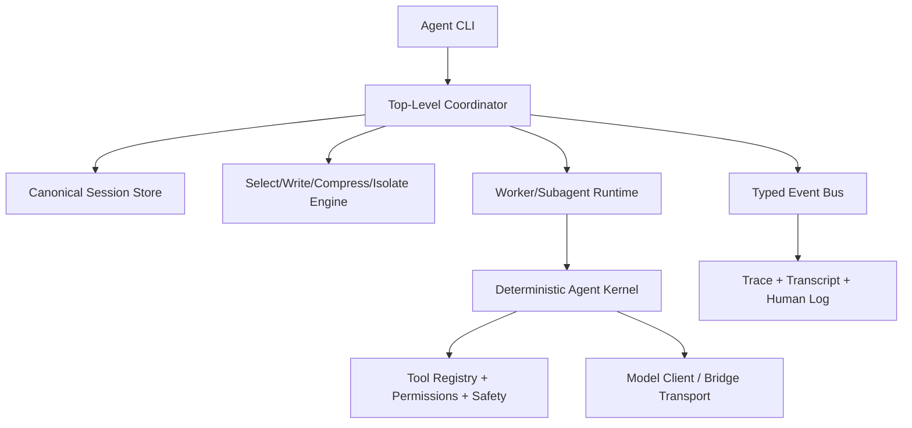

# Runner As Top-Level Agent: Stripdown And Rebuild Plan

## Current Capability Baseline (What You Already Have)
- Core turn engine exists in [`src/runner/run.js`](/Users/alanman/Developer/claude-local-bridge-playground/src/runner/run.js): model call, tool loop, stop conditions, streaming/JSON outputs, retry paths.
- Tool and permission gate exists in [`src/runner/tool-registry.js`](/Users/alanman/Developer/claude-local-bridge-playground/src/runner/tool-registry.js) and [`src/runner/permissions.js`](/Users/alanman/Developer/claude-local-bridge-playground/src/runner/permissions.js).
- Safety primitives exist in [`src/runner/safety.js`](/Users/alanman/Developer/claude-local-bridge-playground/src/runner/safety.js): cwd validation, path confinement, deny matrix, env scrubbing, redaction.
- CLI control surface exists in [`bin/local-bridge-runner.js`](/Users/alanman/Developer/claude-local-bridge-playground/bin/local-bridge-runner.js): flags for modes, limits, trace/output formats, resume.
- Logging/observability exists via transcript + human log + runner trace.

## Direct Gap Vs Claude Code (Top-Level Agent Ambition)
- Missing canonical session state model (currently transcript reconstruction, not authoritative state snapshot).
- Missing compaction ladder (currently budget warning/halt, not graded select/snip/summary/ghost compaction).
- Missing first-class orchestration runtime (subagent lifecycle manager, queueing, cancellation, parent synthesis contracts).
- Missing dynamic memory stack (instruction memory + auto-memory + extraction/promotion flows).
- Missing skill runtime (metadata discovery + lazy activation + scoped execution).
- Missing lifecycle hooks framework and trust-gated extension system.
- Missing typed event contract for robust machine orchestration parity.

## Minimum Kernel You Can Strip Down To
- Keep only: `run loop + tool dispatch + permission gate + stop guards + event output + model transport`.
- Temporarily remove from “core identity”: rich prompt prose, transcript replay semantics, optional human logs, non-essential CLI sugar.
- Treat this stripped core as **AgentKernel** (single-responsibility: deterministic execution of one run graph).

## Bottom-Up Rebuild To First-Class Orchestrating Agent

## Build Sequence (Inside-Out)
1. **Freeze kernel boundary**
   - Define `AgentKernel` contract (inputs, outputs, error/stop reasons) around current `run()` behavior.
2. **Install canonical session store**
   - Add authoritative flat JSON session state (messages + runner metadata) separate from transcript.
3. **Add context engine**
   - Implement compaction ladder with explicit thresholds and “snapshot markers.”
4. **Introduce coordinator runtime**
   - Add top-level task graph: research -> synthesize -> execute -> verify.
5. **Add worker/subagent runtime**
   - Scoped tool allowlists, lifecycle state machine, cancellation, parent result schema.
6. **Add memory + skills layers**
   - Instruction memory precedence, auto-memory writeback, lazy skill discovery/load.
7. **Add hook system and trust gates**
   - Pre/post lifecycle injection with all-or-nothing trust policy.
8. **Harden observability contract**
   - Stable typed events for automation, explicit stop reason taxonomy, correlation IDs across parent/child runs.

## Decision Rules For This Playground
- Bridge remains transport only; runner/coordinator owns orchestration logic.
- File-native tools remain safety anchor; shell remains opt-in and policy-gated.
- Every new subsystem must declare: state shape, failure mode, observability fields, and downgrade behavior.

## Validation Strategy Before Any Big Expansion
- Verify kernel determinism under fixed prompts/tool mocks.
- Verify session resume correctness from canonical state, not transcript replay.
- Verify post-compaction continuity (active task IDs + safety rules persist).
- Verify coordinator synthesis quality (no raw delegation without parent synthesis step).
