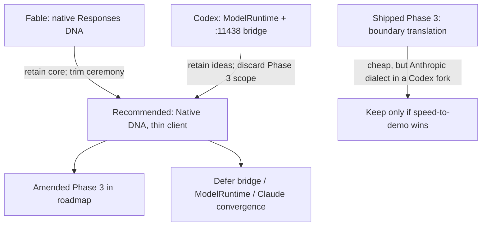

# Phase 3 Proposal Critique and Recommended Path

## Context (what “truth” is today)

Three conflicting stories exist in the Codex fork:

| Layer | Says |
|-------|------|
| Shipped plan of record — [docs/codex-bridge-runner-roadmap.html](docs/codex-bridge-runner-roadmap.html), [AGENTS.md](AGENTS.md), [CLAUDE.md](CLAUDE.md), [README.md](README.md) | Phase 3 = **boundary translation**: keep Anthropic `tool_use`/`tool_result` internally; translate only in `model-client.js`. 3–4 sessions. Tools/pipeline/compactor untouched. |
| [docs/Phase 3 Codex-DNA Rewrite Suggested by Fable.md](docs/Phase%203%20Codex-DNA%20Rewrite%20Suggested%20by%20Fable.md) | **Native-first**: internals become Responses items. Claims Alan already decided this. ~8–12 sessions. Direct over `codex-transport.js`. |
| [docs/Phase 3 Native Convergence Roadmap Suggested by Codex.md](docs/Phase%203%20Native%20Convergence%20Roadmap%20Suggested%20by%20Codex.md) | **Neutral harness + native runtimes + local bridge on :11438**. Phases 3A–3E, then Claude convergence. Much larger reset. |

Code reality matches the **shipped boundary story**, not either proposal: `model-client.js` still talks to `localhost:11437/v1/messages`; `codex-transport.js` exists but is unwired; Anthropic shapes are deep (~112 hits across ~37 runner files).

**Assumption for this critique:** treat Fable’s “Alan already chose native-first” as **provisional** until you confirm it in chat. The recommendation below assumes you want a clean Codex species and are willing to pay ~2–3× the original Phase 3 cost. If you prefer cheapest-first PoC, keep the shipped boundary plan instead (see “When to keep boundary translation”).

---

## Bottom line

**Recommended synthesis: Native DNA, thin client.**

- Adopt Fable’s native Responses item list as the fork’s internal conversation state.
- Do **not** build a `:11438` bridge or a full `ModelRuntime` interface in Phase 3.
- Do **not** start Claude-repo convergence work from this fork’s Phase 3.
- Keep Phase 2’s direct `CODEX_ACCESS_TOKEN` → `codex-transport.js` path as the default until a live agent loop exists.

---

## Critique of the shipped Phase 3 (baseline)

**What it got right (retain as constraints even if schema changes):**

- Translate/adapt at a **thin boundary**; do not spread wire details through tools/safety/permissions.
- Delete `cache_control` budgeting (Phase 0 proved caching is automatic).
- Map usage; add `gpt-5.5`; leave safety/permissions/CLI mostly alone.
- Exit criteria shaped as offline tests + one golden/e2e loop before live ladder (Phase 4).
- Phase 2 decision: daemon is **optional later**, not a PoC blocker.

**What aged poorly:**

- “Keep Anthropic-block dialect forever inside a Codex fork” fights Option C’s purpose (freedom to delete Claude transport DNA). It creates a permanent fake dialect: every new Codex-native concern (reasoning item IDs, `call_id`, empty `response.output`, no `is_error`) gets shoehorned into Claude shapes.
- Protocol notes already show gaps the adapter would paper over: function_call/reasoning SSE not yet captured; `response.output` may be empty; effort `max` may not exist natively.
- Part 2’s “cheapest correct design” was correct **before** the fork existed. After Option C, cheapest ≠ cleanest species.

**Verdict on shipped Phase 3 text:** amend Parts 2/5 — keep the *thin-boundary* and *test-shaped exit* ideas; replace “Anthropic lingua franca” with “Responses items lingua franca” for this fork only.

---

## Fable proposal — retain / discard / amend

### Retain (high value)

- **Native Responses items as internal state** — the right species decision for Option C.
- **Honest scope (~8–12 sessions)** — more credible than roadmap’s 3–4 once pipeline/compactor/goldens move.
- **Staged green gates** (branch → fixtures → `items.js` → client → loop → pipeline/compactor → observability → goldens → e2e → docs).
- **`src/runner/items.js` contract module** — constructors/extractors/type guards before rewriting `run.js`.
- **Fixture capture helper** + Alan-gated captures for function_call and post-tool final answer (also settles reasoning/`effort`/`temperature` questions).
- **Error-prefix convention** for tool failures (Responses has no `is_error`) — document, don’t fake a Claude field.
- **Document resume break** for pre-native sessions — fail closed, don’t invent a translator.
- **Phase 6 comparisons at rollup metrics** (cost/steps/stop reasons), not byte-identical transcripts.
- **Junk cleanup:** `verify-done`, `FOLDER-STRUCTURE.md` (and likely the `verify-*.log` siblings).
- **`DEFAULT_MODEL` → `gpt-5.5`**; delete Anthropic cache-hit logging; `_transport` meta instead of `_localBridge`.

### Discard or demote

- Treating “Alan already decided” as recorded fact in the roadmap until you confirm — today AGENTS/CLAUDE/README still say boundary translation. Record the decision formally when amending the HTML roadmap (same style as Option C).
- Renaming all 24 tools to OpenAI’s `parameters` **as the only schema** without a short internal alias — locks tool files to OpenAI wire names. Prefer: tool modules keep a single internal key (either keep `input_schema` and map at request build, or introduce neutral `inputSchema` once). Do not do a 24-file rename *and* a later neutral rename.
- Full observability schema rewrite in the same phase as first green loop — amend to **minimal** updates (`provider: codex`, usage fields including `reasoning_tokens`) and defer transcript/archive “v2 redesign” unless resume requires it.
- Absolutist “no Anthropic shapes anywhere” as a Phase 3 day-one lint — good as a **late** fence test after the loop works; premature as Stage 0.

### Amend

- Stage order is mostly right; tighten Stage 5–6 so the first e2e mock loop can pass before every archive/human-log test is perfect.
- Pricing: keep “reference API rates, labeled not-subscription-billing” — do not invent USD certainty for Business plan usage.
- After merge: rewrite roadmap Parts 2/5 and AGENTS/CLAUDE so they stop contradicting the code.

**Fable verdict:** best primary plan. Adopt with the trims above.

---

## Codex proposal — retain / discard / amend

### Retain (ideas, not Phase 3 scope)

- **Converge on behavior, not shared schemas** — correct long-term framing for two forks.
- **Fail-closed malformed function arguments** — never execute `{}` on bad JSON.
- **Assemble from SSE item events**, not final `response.output` (matches Phase 0 risk that terminal output arrays can be empty).
- **Preserve reasoning items verbatim** (ids, encrypted content, order) under `store:false` + `include:["reasoning.encrypted_content"]`.
- **Compaction rules:** don’t orphan reasoning from its message/function_call; clip outputs without breaking `call_id` linkage; compact only at completed turn boundaries.
- **Architectural fence tests** (no `/v1/messages`, `tool_use`, `cache_control` in *active Codex runtime path*) — after the rewrite lands.
- **Reject inherited Anthropic/v1 sessions clearly**; leave old files untouched.
- **Usage without double-counting cached tokens.**
- **Credits / official rate card** as a *later* reporting concept — verify numbers live from [Codex rate card](https://help.openai.com/en/articles/20001106-codex-rate-card-2) when implementing (page is dynamic; don’t trust proposal digits blindly). Reference USD table can ship first.
- Phase 4 ladder additions: session resume + compaction earlier in the live climb — good amendments to Phase 4, not Phase 3 blockers.

### Discard for Phase 3 (overreach / contradicts prior decisions)

- **Native local bridge on `:11438` as Phase 3B** — reopens Part 4 Option A after Phase 2 explicitly chose direct token client (“daemon optional later”). Adds a second process, caller-token files under `~/.codex-local-bridge/`, and novice operational load before any agent loop works. Security outcomes (redaction, env scrub, localhost-only upstream) are already largely in Phase 2 transport + safety.
- **Full `ModelRuntime` interface + injected kernel** before first live Codex turn — correct *eventually* if Claude convergence is the goal; wrong *now*. It forces rewriting `run.js` twice (once to interface, once to make Codex work).
- **Phases 6–7 (Claude convergence + shared-core extraction)** inside this Phase 3 critique window — wrong repo timing; Option C accepted double maintenance until evidence says otherwise.
- **Schema v2 bump + neutral event rename (`tool_call` etc.) as Phase 3A gate** — process theater before a working client.
- **`--max-credits` as Phase 3D exit** — product polish; Phase 4/5.
- **Cross-repo “replace Claude roadmap copy”** as Phase 3E — scope creep; optional later note in Claude playground only if you ask.
- **LaunchAgent** in near-term hardening — defer indefinitely for PoC.

### Amend if/when revived

- Bridge belongs as **Phase 5 optional** (or Phase 6 exploratory), with the same threat-model goals Codex listed, only after the direct path proves the loop.
- `ModelRuntime` belongs after **both** forks want parity tests — i.e. old roadmap Phase 6/7, not Codex-proposal Phase 3C.

**Codex verdict:** excellent architecture essay; poor Phase 3 execution plan. Mine it for invariants; do not adopt its phase structure.

---

## Recommended amended Phase 3 (what to write into the roadmap)

Replace current Phase 3 bullet list with roughly:

1. **Record decision:** this fork’s internal conversation state is native Responses items (supersedes Part 2 “Anthropic lingua franca” *for the Codex fork only*). Feature branch + draft PR.
2. **Cleanup + capture tooling:** remove junk files; add redacting fixture capture script over `codex-transport.js`.
3. **Alan capture gate:** function_call SSE + final-answer SSE; note reasoning presence/absence; map `effort` (`max` → nearest allowed); drop `temperature` if rejected.
4. **`items.js` + rewrite `model-client.js`** over `codex-transport` (streaming-only; tolerate `obfuscation`; fail-closed arg JSON; no Anthropic request shapes).
5. **`run.js`:** history as item list; delete `cache_control`; usage mapping; default model `gpt-5.5`.
6. **`tool-pipeline.js` + `context-compactor.js`:** emit/consume `function_call` / `function_call_output`; compaction respects reasoning adjacency.
7. **Minimal observability:** provider tag + usage fields; clear error on old-session resume.
8. **Goldens + offline e2e mock loop** (runner → transport mock → real local tool → final answer).
9. **Pricing row + docs:** roadmap Parts 2/5, AGENTS/CLAUDE, protocol notes, README status.

**Explicitly out of Phase 3:** `:11438` bridge, `ModelRuntime`, Claude-repo port, multimodal, LaunchAgent, `--max-credits`.

**Exit criteria (merge of both proposals, slimmed):** offline fixture client tests; one full mock e2e loop; `npm test` / lint / format green; roadmap/AGENTS no longer claim boundary translation.

Phase 4 stays the live capability ladder (add resume + compaction checks from Codex proposal). Phase 5 can optionally revive the local bridge if multi-client or stricter credential isolation becomes a real need.

---

## When to keep boundary translation instead

Choose the **shipped** Phase 3 only if the goal this week is “see a Codex model call `list_files` ASAP” and you accept Anthropic-shaped transcripts in a Codex repo. It is still coherent engineering — just the wrong long-term DNA for Option C. If you pick it, ignore both proposal docs’ “superseded” claims and only cherry-pick: fixture captures, fail-closed args, SSE assembly caution, delete `cache_control`, pricing.

---

## Suggested doc actions (after you approve a direction)

- Update [docs/codex-bridge-runner-roadmap.html](docs/codex-bridge-runner-roadmap.html) Parts 2, 5, next-steps (and mark the architecture decision like Option C).
- Align [AGENTS.md](AGENTS.md) / [CLAUDE.md](CLAUDE.md) / [README.md](README.md).
- Keep both suggestion markdown files as **archived proposals** (rename/move under `docs/lab-notes/proposals/` or add a header “superseded by roadmap decision YYYY-MM-DD”) so the critique trail remains.
- Do **not** implement code until the roadmap decision text is agreed.

---

## One confirmation needed from you

Reply with one of:

1. **Native DNA (recommended)** — proceed to amend roadmap toward Fable-core / thin-client Phase 3.
2. **Boundary translation** — keep shipped Phase 3; archive both proposals as rejected-for-now.
3. **Full Codex convergence** — accept `:11438` + `ModelRuntime` in Phase 3 (not recommended; say so explicitly if you want it anyway).
