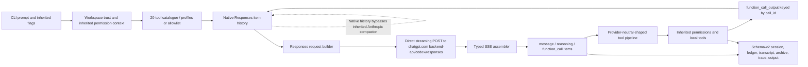
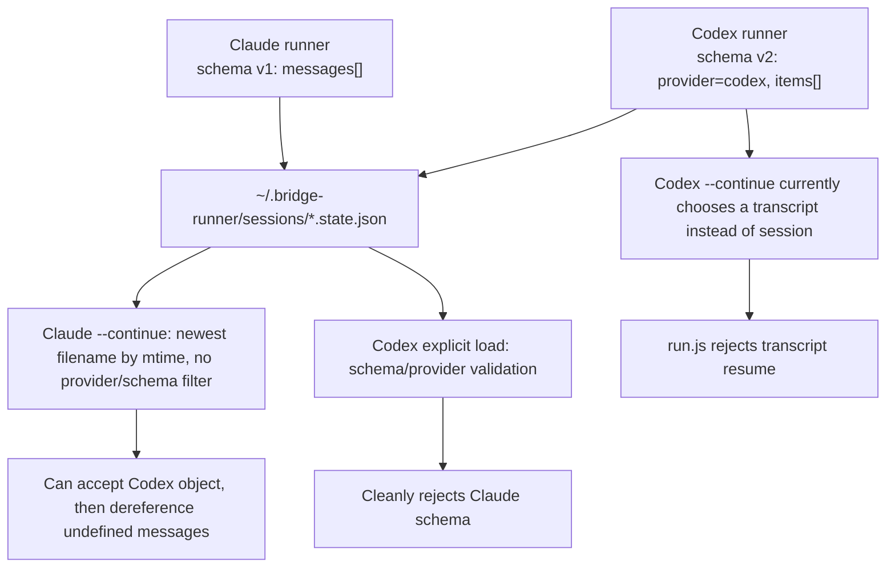
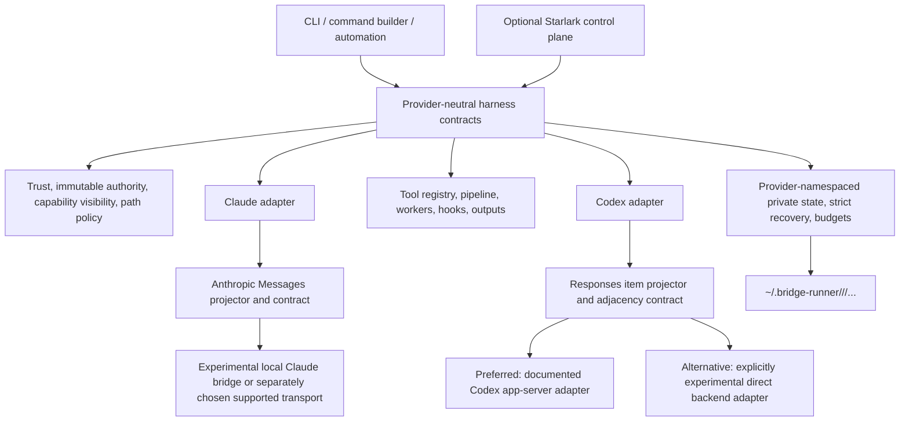

# Claude-to-Codex Runner Architecture and Runtime Pivot Audit

**Decision-quality current-state review**  
**Audit date:** 2026-08-10 (America/Los_Angeles)  
**Mode:** read-only investigation; no source, configuration, or existing documentation changed  
**Authoritative source lane:** `claude-local-bridge-playground`  
**Codex comparison lane:** `codex-local-bridge-playground`  
**Shared runtime-state root:** `~/.bridge-runner`  
**Historical Claude bridge reference:** `claude-local-bridge`

> **One-sentence verdict:** Preserve the Codex-native Responses vertical slice, stop a file-by-file Claude port, and first establish provider-independent authority, private/provider-namespaced state, recovery, and observability contracts; then build a Responses-native context engine and a supported Codex transport adapter behind those contracts.

---

## 1. Executive summary and recommended pivot

The Codex repository is not an empty or failed port. Its central architectural decision is sound and should be preserved: conversation history remains native OpenAI Responses items (`message`, `reasoning`, `function_call`, and `function_call_output`) from model boundary through persistence. Its offline native loop is real, not just documented: 603 tests passed, three golden evaluations passed, and the mock-SSE end-to-end test exercises the real loop and a real local `list_files` tool without credentials.

The Codex repository is nevertheless **not caught up to the current runner control plane**. Since its Stage 6 baseline, the Claude playground has added or substantially rebuilt immutable authority ceilings, tool capability groups, private artifact writers, a single deep-redaction boundary, stricter ledger recovery, honest session continuation, context projection and message-contract checks, child budget leasing, worktree confinement, false-green tests, and a separate Starlark orchestration host. Many of those changes express provider-independent safety and durability properties. They should be translated as contracts and tests, not copied as Anthropic-shaped files.

The first structural risk is already visible in local operation. Both runners use the same `~/.bridge-runner/sessions` namespace but write incompatible session schemas. Codex schema v2 identifies `provider: "codex"` and stores `items`; Claude schema v1 stores `messages` and does not validate provider ownership on load. Claude's new `--continue` selects the newest `*.state.json` by modification time without checking schema or provider. A focused no-write runtime probe confirmed that Claude's loader accepts a Codex session object and leaves `messages` undefined; the current resume path then dereferences `sessionStore.messages.length`. Codex rejects a Claude schema cleanly, but its own `--continue` still selects a transcript and then enters a run path that explicitly rejects transcript resume. In plain language: automatic continuation is not safe or honest in the shared state root today.

The recommended pivot has five parts:

1. **Preserve the native Codex core.** Keep `items.js`, native SSE assembly, Responses-native request construction, function-call/result pairing, provider-tagged schema v2, offline fixtures, native fence tests, golden evaluations, and the Stage 7 pricing logic.
2. **Define a provider-neutral harness contract before further feature porting.** Authority, tool visibility, path-key ownership, trust, redaction, private persistence, recovery, budgets, output events, and worker inheritance should have one semantic specification with provider-specific adapters at the conversation and transport edges.
3. **Repair the shared-state boundary before live expansion.** Namespace sessions, ledgers, logs, traces, archives, campaigns, and indexes by provider/lane; validate provider and schema before selection; make all sensitive directories `0700` and files `0600`; and provide an explicit, non-destructive discovery/migration plan for existing artifacts.
4. **Build context management natively for Responses.** Do not feed Responses items into the Anthropic compactor. A Codex context projector must preserve reasoning items and function-call/output relationships, apply deterministic budgets, expose terminal states, and prove that no required item is orphaned.
5. **Choose a supported Codex transport boundary before the next paid proof.** Official OpenAI material documents programmatic Codex access through the Codex CLI and app-server. It does not establish the custom direct `POST https://chatgpt.com/backend-api/codex/responses` client as a supported integration surface. The preferred next design decision is a thin app-server adapter; retaining the direct endpoint should remain an explicitly experimental, drift-prone alternative.

### Recommended first owner decision

Choose the Codex transport support boundary:

- **Recommended:** adopt Codex app-server (or another documented Codex automation surface) behind a thin transport adapter, while keeping the native Responses item contract.
- **Alternative:** retain the direct ChatGPT backend client as a personal-research transport, explicitly accept that its endpoint and event details are unversioned for this use, and fund recurring capture/fence maintenance.

Do not start by copying Claude files or by running the pending paid live proof. The transport decision determines which live proof is meaningful.

---

## 2. Audit provenance, folders, branches, commits, and dirty-state caveats

All preflight checks were performed before repository-specific tests. No pull was performed because the audit was explicitly read-only.

| Role                                                    | Absolute path                                             | Repository / branch          | Audited commit                                                                                                                  | Working-tree and remote caveat                                                                                                                                                                                                                                                                                                                                                                                                                                                         |
| ------------------------------------------------------- | --------------------------------------------------------- | ---------------------------- | ------------------------------------------------------------------------------------------------------------------------------- | -------------------------------------------------------------------------------------------------------------------------------------------------------------------------------------------------------------------------------------------------------------------------------------------------------------------------------------------------------------------------------------------------------------------------------------------------------------------------------------- |
| Authoritative runner source                             | `/Users/alanman/Developer/claude-local-bridge-playground` | Git, `main`                  | Final refreshed head `81f233fb12d0bbc56bdea4f41c3cbd5e87df2652`; core audit snapshot `e197c2e1cbce45c31a4afadd58599fedebda45c9` | Initial preflight found a clean tree one commit ahead of origin at `e197c2e1…`. Concurrent work first advanced it to the Bundle C commit `8e7c5acf…`, aligned with origin, then three additional local Starlark-only commits advanced it to `81f233fb…`, three commits ahead of `origin/main`. All intervening diffs were inspected and the current offline gates were rerun. `origin` is `alankatanoisi/claude-local-bridge-playground`; the canonical archive push lane is disabled. |
| Codex port and report destination                       | `/Users/alanman/Developer/codex-local-bridge-playground`  | Git, `main`                  | `cbc216a9350eeb2438aca35d5c49df15f849e183`                                                                                      | `main` matched `origin/main`, but the working tree contained intentional uncommitted Stage 7 changes. They were preserved exactly. `origin` is `alankatanoisi/codex-local-bridge-playground`.                                                                                                                                                                                                                                                                                          |
| Shared runtime state named “bridge-runner” by the owner | `/Users/alanman/.bridge-runner`                           | **Not a Git repository**     | Not applicable                                                                                                                  | Sensitive local state/control root. Inspected by metadata and aggregate counts only; no prompt, transcript, trace, ledger, token, or credential payload was opened.                                                                                                                                                                                                                                                                                                                    |
| Historical/canonical Claude bridge reference            | `/Users/alanman/Developer/claude-local-bridge`            | Git, `codex/runner-clean-pr` | `af556b4159b33f5b510cda583b95fc54570eb157`                                                                                      | Branch one commit ahead of origin; only `.DS_Store` dirty. This repository is reference-only for the playground. `origin` is `alankatanoisi/claude-local-bridge`.                                                                                                                                                                                                                                                                                                                      |

### Codex Stage 7 dirty state preserved

The pre-existing Codex changes were:

- Modified: `CLAUDE.md`, `README.md`, `bin/local-bridge-runner.js`, `docs/codex-bridge-runner-roadmap.html`, `docs/lab-notes/proposals/README.md`, `src/runner/codex-transport.js`, `src/runner/context-builder.js`, `src/runner/model-pricing.js`, and `test/runner/model-pricing.test.js`.
- Deleted at their former locations: three superseded Phase 3 proposal/critique Markdown files.
- Untracked: `docs/lab-notes/proposals/archive/`, containing those three documents with only link/path adjustments and final-newline differences from their tracked predecessors.
- Aggregate tracked diff at preflight: 12 files, 184 insertions, 570 deletions. Most deletions are the proposal moves, not discarded content.

This report adds only itself and its HTML companion under `docs/architecture-audits/`. It does not normalize, stage, or otherwise touch the Stage 7 work.

### Concurrent authoritative-source advancement

The Claude preflight and main runner/transport audit were performed at `e197c2e1…`. The same checkout then advanced—without action by this audit—to `8e7c5acf…` (`Bundle C results: R4 planner evaluation (25 live trials) + three scorer-bug fixes`, committed 2026-08-10 09:16:36 -0700). That six-file diff changed `CLAUDE.md`, two Starlark result/handoff documents, the Starlark README, its evaluation scorer, and scorer tests. It did **not** change the Claude runner, bridge transport, authority, context, session, permission, or tool files supporting this report's main conclusions.

Before final validation, three more local commits advanced only `starlark-host/` to `81f233fb…`: R13 cost-tiered planner escalation (`86b909ed…`), R9 a deterministic zero-cost second worker provider (`032f6fce…`), and R14c a host-JSON path for fully determined plans (`81f233fb…`). The aggregate diff from `8e7c5acf…` was 11 Starlark source/test files, 714 insertions, and 42 deletions; again, no runner-core, bridge, permission, session, context, or tool file changed. Source and tests were inspected. At `81f233fb…`, `npm test` passed with 993 passes plus one pinned TODO, `npm run test:starlark` passed 84/84, and lint/docs/format checks passed. The checkout was clean and three commits ahead of `origin/main`. Raw local evaluation ledgers/prompts/traces were not opened.

### Applicable instructions

- The Claude playground's `AGENTS.md`, `CLAUDE.md`, and `SECURITY.md` were read. They make the playground authoritative for the active runner, keep the native Anthropic `/v1/messages` surface, retire agent/profile runtime concepts, preserve conservative safety defaults, and classify the OAuth bridge as personal research rather than proof of provider approval.
- The Codex repository's `AGENTS.md` and `CLAUDE.md` were read. They require native Responses items, `CODEX_ACCESS_TOKEN` as the only token source, no `~/.codex/auth.json` scraping, no Anthropic wire shapes on the active path, and preservation of the uncommitted Stage 7 work.
- The canonical bridge's instructions were read. They identify it as a historical/reference boundary, not the active playground target.
- `~/.bridge-runner` contains no applicable `AGENTS.md` or `CLAUDE.md` of its own.

---

## 3. Methodology and evidence-strength definitions

The audit compared semantic contracts, state ownership, failure behavior, enforcement points, and tests. Matching filenames or inherited CLI flags were never treated as parity by themselves.

### Evidence labels

| Label                      | Meaning in this report                                                                                                           |
| -------------------------- | -------------------------------------------------------------------------------------------------------------------------------- |
| **Source-proven**          | The current audited file directly implements the stated behavior. This does not by itself prove every runtime path executes it.  |
| **Test-proven**            | A current automated test exercised the behavior, and the relevant test command passed during this audit.                         |
| **Offline-runtime-proven** | A focused local execution exercised the real module or loop without provider credentials or paid model use.                      |
| **Documented**             | Current documentation claims the behavior. A documentation claim is not upgraded to runtime fact unless source/tests support it. |
| **Historical/superseded**  | Commit history or archived design material explains why something exists, but it is not the current plan.                        |
| **Inferred**               | The conclusion follows reasonably from multiple facts, but was not directly exercised end to end.                                |
| **Unverified/broken**      | The behavior lacks necessary evidence, or current source leads to an explicit failure.                                           |

### Investigation methods

- Repository preflight: absolute path, Git root, branch, commit, remotes, worktrees, and dirty status.
- Source mapping: CLI entry points, run loops, transport, provider representation, tools, permissions, trust, state, outputs, hooks, customization, workers, and orchestration.
- Focused current-history review from the Codex Stage 6 period through the Claude playground's current head.
- Non-destructive test and static-check execution in all three Git repositories.
- Offline runtime probes with synthetic, credential-free input for the cross-provider session boundary.
- Metadata-only inventory of `~/.bridge-runner`: counts, directory/file modes, timestamps, and ownership. Payload contents were deliberately excluded.
- Current official provider documentation checks for Responses semantics, Codex access-token automation, Anthropic authentication, and subscription OAuth boundaries.

### Deliberate exclusions

- No live OpenAI or Anthropic model request was initiated by this audit. A concurrent externally executed Starlark evaluation was incorporated only from its committed aggregate report and source diff.
- No credential discovery, value inspection, token printing, or auth-file access.
- No replay of existing user transcripts, traces, or ledgers.
- No source or existing project-document edits.
- No pull, commit, push, reset, checkout, migration, or cleanup.
- No claim that passing tests establish provider approval or live semantic quality.

---

## 4. Current architecture of each audited location

### 4.1 `claude-local-bridge-playground`: current authoritative implementation

This repository now contains three architectural layers:

1. **A small Anthropic-native runner loop** under `bin/local-bridge-runner.js` and `src/runner/**`.
2. **A Claude-specific local OAuth transport shim** under `src/server.js`, `src/proxy.js`, `src/credentials.js`, `src/fingerprint.js`, and `src/interceptors/**`.
3. **A separate experimental Starlark orchestration host** under `starlark-host/`, with its own package and tests. It invokes bounded workers but is not integrated into the runner core.

The runner exposes the same 20 local tools as the Codex fork, but current defaults are expressed as capability groups (`core`, `edits`, `recovery`, `agents`, `worktrees`, `skills`, `lsp`, `shell`). The safe core is narrow; shell and advanced patching stay hidden unless explicitly enabled. Agent and tool profile systems are deliberately retired.

The current loop creates an immutable authority ceiling at startup, validates workspace trust, derives the visible tool surface, constructs/project-manages Anthropic messages, calls the local bridge, validates tool-result adjacency, runs tools through permission and pipeline layers, and persists redacted state through private writers. Child workers receive narrowed authority and token leases rather than fresh independent authority.

The context lane was substantially rebuilt. Raw conversation history remains distinct from the projected request. A context state/epoch records instruction identity; the projector applies deterministic policy; the message contract validates Anthropic ordering. This is meaningful architecture, but its data-plane implementation is Anthropic-specific and cannot be copied into native Responses history.

At the Bundle C `8e7c5acf…` snapshot, the separate Starlark host gained a committed repeated-trial evaluation: five planner models × five repetitions on one fixed mixed-fault fixture, 271 upstream calls, and $6.2881 settled under an owner-authorized $20 durable campaign. The committed aggregate report records zero authority-field attempts, zero proposed permanent-fault retries, 25/25 complete traces, and three scorer bugs found by checking aggregates against durable ground truth.

At the final current `81f233fb…` head, three later offline slices add a cheap-first planner ladder with measured escalation, a deterministic zero-cost second worker provider behind the same host-owned registry contract, and a host-JSON plan/recovery path for fully determined fan-out. Crucially, host-JSON plans still pass through the same descriptor validator, and symbolic plans still cannot choose providers or models. These changes strengthen the case that the Starlark layer is a serious, separately evaluated provider-neutral control-plane experiment; they do not make it a native Runner integration or a Codex-ready adapter.

### 4.2 `codex-local-bridge-playground`: native Responses core plus inherited control plane

The Codex fork is a separate repository seeded from an earlier Claude runner. Its active provider path is now native:

- `items.js` defines a schema-v2, `provider: "codex"` contract and native item constructors/guards.
- `model-client.js` builds native Responses requests and assembles typed SSE events.
- `codex-transport.js` sends a streaming-only request directly to the ChatGPT Codex backend using `CODEX_ACCESS_TOKEN` from the environment.
- `run.js` keeps native items in history, replays reasoning items, appends function outputs by `call_id`, and intentionally bypasses the inherited Anthropic compactor.
- The native fence test blocks `/v1/messages`, `cache_control`, and Anthropic request grammar on the active path.

Around that native core, much of the older provider-neutral-looking harness remains: the same 20 tools, permissions, trust, shell policy, hooks, prompts, skills, workers, archives, outputs, and ledgers. “Provider-neutral-looking” is not the same as current parity. The fork lacks the Claude lane's authority ceiling, capability-group visibility, private filesystem layer, deep-redaction boundary, session anchor, rebuilt context projection/runtime policy, strict message contract, budget broker, and several crash/false-green controls. It still exposes the retired `--agent` and `--profile` systems.

### 4.3 `~/.bridge-runner`: shared state root, not a shared codebase

The owner clarified that “bridge-runner” means `/Users/alanman/.bridge-runner`. It is not a Git repository and contains no runner source. It is the local persistence and coordination root shared by runner versions and provider lanes.

Top-level areas observed were:

- `archive/`
- `campaigns/`
- `cc-bridge-runner/`
- `fingerprint-checks/`
- `logs/`
- `sessions/`
- `skills/`
- `traces/`
- `worktrees/`
- `.DS_Store` and `trust.json`

Aggregate inventory at audit time:

| Area                 |  Files | Directories | Approximate size (KiB) | Interpretation                                                                   |
| -------------------- | -----: | ----------: | ---------------------: | -------------------------------------------------------------------------------- |
| `archive`            | 10,411 |       1,081 |                 66,396 | Per-run/session artifacts and exports; sensitive.                                |
| `campaigns`          |      2 |           3 |                    184 | Durable campaign budget/control state.                                           |
| `cc-bridge-runner`   |     12 |           4 |                     56 | Runner-related local material; contents not opened.                              |
| `fingerprint-checks` |      4 |           1 |                     16 | Claude transport diagnostics; provider-specific.                                 |
| `logs`               |  2,494 |           1 |                 34,548 | Human/machine transcripts; sensitive.                                            |
| `sessions`           |  3,148 |           1 |                 29,972 | Canonical checkpoints and ledgers from more than one runner generation/provider. |
| `skills`             |      1 |           1 |                     16 | User customization text.                                                         |
| `traces`             |    202 |           1 |                374,668 | Flight-recorder data; highly sensitive even when redacted.                       |
| `worktrees`          | 38,494 |       5,878 |                629,748 | Git worktree checkouts; largest part of the tree.                                |

The root directory was owner-only (`0700`), and `trust.json` was `0600`. Current sensitive writers are inconsistent across history: many files are `0600`, but thousands of archive files and hundreds of logs/sessions/traces are `0644`; several artifact directories are `0755`. With the current local `umask 022`, the audited Codex writers that do not set explicit modes can create `0644` files and `0755` directories. This establishes a shared-state hardening gap; metadata alone cannot safely attribute each older file to a particular binary or provider.

This folder should remain a **state root**, not become a place to copy source modules. Shared code belongs in a versioned package or repository; shared layout/version/index rules govern this folder.

### 4.4 `claude-local-bridge`: historical Claude transport boundary

The canonical/reference repository is older and materially different from the active playground. It still exposes Anthropic and OpenAI-compatible routes, includes API-key and multiple credential fallbacks, and predates the current runner hardening and minimal Anthropic-only direction. Its tests validate that historical contract, not today's architecture.

Its useful role in this audit is boundary archaeology:

- The local HTTP server, credential acquisition, upstream proxy, fingerprint/header behavior, and interception are Claude-specific transport concerns.
- OpenAI-compatible routes and upstream API-key fallback are obsolete for both current playground directions.
- Passing canonical tests do not make those old surfaces candidates for a Codex port.

---

## 5. End-to-end runtime flow diagrams

### 5.1 Current Claude runner flow

```mermaid
flowchart LR
    A["CLI prompt and explicit flags"] --> B["Bootstrap, workspace trust, immutable authority ceiling"]
    B --> C["Capability groups and visible tool definitions"]
    C --> D["Instruction memory plus context projection"]
    D --> E["Anthropic Messages contract validation"]
    E --> F["Runner model client"]
    F --> G["localhost:11437 /v1/messages"]
    G --> H["Claude-specific server, OAuth credential and stable fingerprint"]
    H --> I["Anthropic Messages upstream"]
    I --> J["text / thinking / tool_use response"]
    J --> K["Tool pipeline"]
    K --> L["Authority + permission + path + shell guards"]
    L --> M["Local tool execution"]
    M --> N["Scrubbed tool_result adjacent to tool_use"]
    N --> D
    J --> O["Private/redacted session, ledger, transcript, archive, trace, human output"]
    M --> O
```



### 5.2 Current Codex runner flow



### 5.3 Shared-state collision today



### 5.4 Recommended target boundary



---

## 6. Repository and responsibility-boundary analysis

### Boundary rule

The correct separation is not “Claude files” versus “Codex files.” It is:

- **Harness/control plane:** provider-independent policy and execution semantics.
- **Conversation adapter:** provider-native state, projection, request, response, and tool-pairing contracts.
- **Transport/auth adapter:** provider-specific supported or experimental connection boundary.
- **Persistent state plane:** provider- and schema-owned artifacts in a shared local root.
- **Optional orchestration plane:** durable job planning, budgets, scheduling, recovery, and synthesis above individual runner invocations.

### What belongs where

| Concern                                                                                     | Correct owner                                              | Reason                                                                                                  |
| ------------------------------------------------------------------------------------------- | ---------------------------------------------------------- | ------------------------------------------------------------------------------------------------------- |
| Authority ceiling, workspace trust, tool visibility, path policy, shell opt-in              | Shared harness contract                                    | These are local-execution safety properties independent of model wire format.                           |
| Tool definitions and local execution                                                        | Shared harness, with explicit optional capability groups   | Both lanes expose the same 20 tools; provider adapters should only translate call/result envelopes.     |
| Anthropic message adjacency, thinking blocks, cache-control markers                         | Claude conversation adapter                                | These are Anthropic data-plane rules.                                                                   |
| Responses items, reasoning replay, `call_id`, typed SSE assembly                            | Codex conversation adapter                                 | Native Responses semantics must remain intact.                                                          |
| OAuth discovery, Claude fingerprint, local `/v1/messages` server, HTTPS interception        | Claude transport adapter                                   | These are Claude Code/Anthropic-specific and policy-sensitive.                                          |
| Codex access token and backend/app-server connection                                        | Codex transport adapter                                    | Credential source and endpoint lifecycle differ from Claude.                                            |
| Session selection, provider/schema identity, private filesystem modes, durable cursor rules | Shared state contract plus provider-specific payload codec | Selection and durability are shared; payload representation is not.                                     |
| Context budget policy                                                                       | Shared interface and invariants                            | Budgets, warning states, and terminal semantics are shared.                                             |
| Context projection/compaction algorithm                                                     | Provider-specific implementation                           | It must preserve the provider's native ordering and opaque item requirements.                           |
| Starlark descriptors, campaign budget, workflow ledger, synthesis                           | Optional shared orchestration layer                        | It coordinates bounded jobs above either provider and should call provider adapters through a registry. |
| `~/.bridge-runner`                                                                          | Shared state root only                                     | It should hold data and user customization, not unversioned source code.                                |

### Critical implication

A future “shared core” should not define a universal conversation message object that flattens provider semantics. It should define narrow interfaces around a provider-owned conversation value, for example:

- `projectForRequest(nativeHistory, policy) -> providerRequestState`
- `validateConversation(nativeHistory) -> diagnostics`
- `extractToolCalls(providerResponse) -> neutral execution intents`
- `encodeToolResults(neutral results) -> provider-native result items`
- `persist(provider, schemaVersion, nativeHistory, runnerState)`

The provider-native history remains opaque to generic tool orchestration except at those explicit adapters.

---

## 7. Detailed Claude-versus-Codex architecture comparison

| Dimension                   | Current Claude playground                                                                                                                                              | Current Codex playground                                                                                                               | Audit judgment                                                                                                       |
| --------------------------- | ---------------------------------------------------------------------------------------------------------------------------------------------------------------------- | -------------------------------------------------------------------------------------------------------------------------------------- | -------------------------------------------------------------------------------------------------------------------- |
| Conversation representation | Anthropic `messages` with content blocks, thinking, `tool_use`, and `tool_result`.                                                                                     | Native Responses items with schema v2 and `provider: codex`.                                                                           | Preserve both native forms; never normalize them into the other's wire grammar.                                      |
| Model boundary              | Local `/v1/messages` bridge; buffered/streaming Anthropic client.                                                                                                      | Direct streaming Responses backend client; typed SSE assembly.                                                                         | Provider-specific adapters. Codex assembly is valuable; its endpoint support boundary needs a decision.              |
| Tool execution seam         | Extracts native calls into neutral tool-use objects, then returns adjacent Anthropic results.                                                                          | Converts function calls to the neutral pipeline and outputs native results keyed by `call_id`.                                         | This seam is the strongest shared-harness candidate.                                                                 |
| Tool catalogue              | 20 tools plus eight capability groups; hidden/optional gates enforced independently of exact allowlists.                                                               | Same 20 tools; no capability groups; profile/allowlist logic inherited.                                                                | Port capability semantics and tests, not the Anthropic catalogue file verbatim.                                      |
| Agent/profile concepts      | Retired from runtime and guarded by tests.                                                                                                                             | `--agent`, file agents, `--profile`, and tool profiles remain active.                                                                  | Codex assumption is stale relative to current direction. Retire after checking any real user dependency.             |
| Authority                   | Immutable startup ceiling; plan/network/shell/write authority can narrow but not widen; child workers inherit a narrowed ceiling.                                      | Mutable context flags and mode checks; no `authority.js` or equivalent ceiling.                                                        | High-priority provider-independent gap.                                                                              |
| Path argument contract      | Catalogue declares canonical path-argument keys and tests contract coverage.                                                                                           | Permission precheck reads `args.path`; current built-in file tools use `path`, but no catalogue-enforced future alias contract exists. | Port the contract to prevent future tool-schema bypass, but do not mislabel current built-ins as an observed escape. |
| Plan mode                   | Authority ceiling plus plan proposals and no-effect tests.                                                                                                             | Inherited `plan_only` mode without current ceiling architecture.                                                                       | Preserve user-facing behavior; port stronger enforcement and tests.                                                  |
| Workspace trust             | Required before powerful operations; child and worktree startup have dedicated gates.                                                                                  | Trust gate exists.                                                                                                                     | Keep Codex behavior, then align exact invariants and tests.                                                          |
| Shell                       | Hidden unless explicitly enabled; documented as unsandboxed local-account authority; no-network is policy, not hard OS isolation.                                      | Hidden/guarded via `allowShell`; inherited scanner and env scrub.                                                                      | Shared invariant. Carry current hardening, retain honest limitation language.                                        |
| Redaction                   | Central recursive/circular-safe boundary plus private writers; applied to outputs, state, logs, traces, workers.                                                       | Multiple `safety.scrub*` calls; no central circular-safe boundary; default-mode writers remain.                                        | Port/redesign as shared serialization boundary.                                                                      |
| Filesystem privacy          | Explicit `0700` dirs, `0600` files, private atomic writes/append.                                                                                                      | Ordinary `mkdir`, `writeFile`, and `open('a')` under process umask.                                                                    | Immediate shared-state remediation dependency.                                                                       |
| Session schema              | v1, no provider field, `messages`; accepts unknown/higher schema and fills defaults.                                                                                   | v2, `provider: codex`, `items`; cleanly rejects legacy/non-Codex sessions.                                                             | Preserve Codex strict codec; add provider identity to Claude; namespace selectors.                                   |
| `--continue`                | Selects newest `*.state.json`; fixed transcript/session confusion, but not provider-aware.                                                                             | Still selects latest JSONL transcript; run loop rejects transcript resume.                                                             | Broken cross-lane user experience. Redesign selection before live expansion.                                         |
| Ledger recovery             | Cursor must exactly match file size; torn-tail handling; private append/cursor; pending-intent recovery.                                                               | Cursor may be behind file yet accepted; corrupt lines skipped; default file modes.                                                     | Port current durability semantics with provider-tagged state.                                                        |
| Context construction        | Rebuilt raw-history/request-projection separation, context anchor/epoch, policy and message contract.                                                                  | Native history bypasses old Anthropic compactor; inherited context builder supplies text/instructions.                                 | Build Responses-native projector from shared policy goals, not Claude shapes.                                        |
| Compaction                  | Active staged/context-aware Anthropic compaction with integrity tests.                                                                                                 | Explicitly disabled for native histories.                                                                                              | Codex gap is honestly acknowledged; required before long-session parity.                                             |
| Model controls              | Current Claude catalogue and model-aware effort/thinking controls.                                                                                                     | `low/medium/high`; `max` silently maps to `high` pending live evidence; Stage 7 adds GPT-5.5 reference pricing.                        | Keep provider-specific catalogues. Surface the unverified effort mapping explicitly.                                 |
| Prompt caching              | Anthropic request-side cache semantics and usage accounting.                                                                                                           | Automatic Responses caching; no cache-control markers; cached tokens are a subset of input tokens.                                     | Codex Stage 7 accounting fix is correct and should be preserved.                                                     |
| Hooks                       | Trusted workspace + hook config; current Claude authority ceiling further constrains effects.                                                                          | Trusted hook config and shell scanning, but no immutable ceiling.                                                                      | Keep customization surface only after authority alignment.                                                           |
| Prompts                     | Minimal defaults, project/global templates, current capability-aware context.                                                                                          | Template registry, injection checks, built-ins and project/global overrides.                                                           | Largely shared candidate; test against native instruction construction.                                              |
| Skills                      | Metadata-only discovery and explicit body load; `run_skill` does not execute embedded actions.                                                                         | Same inherited pattern.                                                                                                                | Shared candidate, but file/state namespaces and instruction precedence need specification.                           |
| Workers/agents              | Bounded workers, narrowed authority, token leases, spawn-depth and wall-time caps.                                                                                     | Older worker/profile model without the latest ceiling/budget broker.                                                                   | Port semantics and tests; do not restore retired personalities.                                                      |
| Orchestration               | Runner coordinator plus separate Starlark host with durable campaign budgets, descriptors, evaluation, map-reduce synthesis, and resume.                               | Older coordinator/worker functions; no Starlark host.                                                                                  | Keep Starlark separate; make provider adapter registry explicit before Codex use.                                    |
| Observability               | Output events, private human logs, redacted transcripts/traces/archives, stronger false-green/telemetry tests.                                                         | Native events and provider-tagged ledgers, but older output/privacy/recovery controls.                                                 | Share schemas at the event/terminal-state layer; retain provider-native payload codecs.                              |
| Test posture                | 994 tests with one explicit known-gap TODO; 75 Starlark tests; adversarial/false-green suites; committed 25-trial Starlark planner evaluation with scorer corrections. | 603 tests, 3 native goldens, mock-SSE E2E and native fence.                                                                            | Preserve both strengths. Add cross-provider and control-plane concordance tests.                                     |

---

## 8. Capability-by-capability translation matrix

The categories are decisions, not implementation completed during this audit.

| Capability                                                      | Decision                                               | Translation rule                                                                                                                                                                            | Dependencies / acceptance evidence                                                                                                  |
| --------------------------------------------------------------- | ------------------------------------------------------ | ------------------------------------------------------------------------------------------------------------------------------------------------------------------------------------------- | ----------------------------------------------------------------------------------------------------------------------------------- |
| Native Responses item schema                                    | **Preserve existing Codex-native implementation**      | Keep schema v2, `provider: codex`, native message/reasoning/call/result items, and clean legacy rejection.                                                                                  | Add namespaced storage and provider-aware selectors without translating item payloads.                                              |
| Native typed SSE assembly                                       | **Preserve existing Codex-native implementation**      | Retain output-item/delta assembly and fail-closed function-argument parsing.                                                                                                                | Re-run fixtures against the selected supported transport; test terminal `completed`, `incomplete`, `failed`, and disconnect states. |
| Direct ChatGPT backend HTTP client                              | **Defer pending owner decision/evidence**              | Keep isolated while deciding app-server versus experimental direct transport. Do not spread endpoint assumptions into the harness.                                                          | Official support decision; redacted protocol fixtures; no live proof until gate passes.                                             |
| Anthropic local server/proxy/credential/fingerprint/interceptor | **Do not port**                                        | Keep entirely in Claude transport lane.                                                                                                                                                     | None for Codex. Preserve research-risk warning in Claude documentation.                                                             |
| Canonical OpenAI-compatible bridge routes                       | **Obsolete/superseded**                                | Do not resurrect `/v1/chat/completions`, `/v1/models`, or API-key fallback.                                                                                                                 | Static fence tests.                                                                                                                 |
| Tool catalogue and executors                                    | **Move/retain in shared infrastructure**               | Same 20 tools and neutral execution result interface; allow provider adapters to encode calls/results.                                                                                      | Provider-independent tool contract tests; no model payload types in executors.                                                      |
| Capability groups/tool visibility                               | **Port substantially as semantics**                    | Adopt Claude's safe-core and explicit optional groups. Exact allowlists must not bypass hidden/gated tools.                                                                                 | Concordance tests for catalogue, visibility, CLI, and prompt descriptions.                                                          |
| Agent/tool profiles                                             | **Reject as stale Codex assumption**                   | Retire `--agent`, `--profile`, lists, loaders, and profile enforcement unless owner identifies an active dependency. Keep explicit templates/capability flags.                              | Usage check, deprecation plan, tests proving removal and no authority widening.                                                     |
| Immutable authority ceiling                                     | **Move/retain in shared infrastructure**               | Create once at startup; every hook, child, worker, plan, network, shell, write, and worktree decision can only narrow.                                                                      | Permission matrix, mutation tests, child inheritance tests, plan no-effect tests.                                                   |
| Path argument ownership                                         | **Move/retain in shared infrastructure**               | Catalogue declares every path-bearing argument; permission and execution layers use the same canonical set.                                                                                 | Schema-concordance mutation test; current built-in tools remain confined.                                                           |
| Workspace trust                                                 | **Port substantially as semantics**                    | Preserve explicit trust gate and fail-closed headless startup.                                                                                                                              | Startup tests for trusted/untrusted/root mismatch and worktree entry.                                                               |
| Shell scanner and opt-in                                        | **Port substantially as semantics**                    | Shell remains hidden unless explicitly enabled; `dont-ask` cannot enable it; sensitive paths/env stay hard-denied.                                                                          | Matrix and adversarial shell tests; documentation says unsandboxed host authority.                                                  |
| Redaction boundary                                              | **Move/retain in shared infrastructure**               | One recursive, circular-safe, provider-aware scrub at every persistence/output boundary; in-memory request state may remain unsanitized only when required for the immediate provider call. | Canary secrets across output types, split streams, errors, traces, ledgers, workers, and circular objects.                          |
| Private filesystem writer                                       | **Move/retain in shared infrastructure**               | All sensitive state dirs `0700`; files `0600`; atomic writes and private append; repair older permissions only through an approved migration.                                               | Mode tests under permissive umasks; crash/rename tests; metadata migration dry run.                                                 |
| Shared state layout                                             | **Redesign and relocate to shared state contract**     | Use provider/lane namespaces and an index that validates provider/schema before selecting latest.                                                                                           | Cross-provider fixtures, no payload rewrite on discovery, deterministic selection tests.                                            |
| Codex session codec                                             | **Preserve and harden**                                | Keep strict schema/provider rejection and native items. Add private writer, strict ledger cursor, and provider-aware location.                                                              | Resume/fork/crash tests; old files remain untouched on rejection.                                                                   |
| Claude session codec                                            | **Adapt**                                              | Add explicit provider/schema validation and namespaced selection; do not silently accept foreign/higher schemas.                                                                            | Cross-provider rejection tests and compatibility decision for existing v1 artifacts.                                                |
| `--continue`                                                    | **Redesign for shared state**                          | Select newest compatible canonical checkpoint, never transcript, using provider/lane index.                                                                                                 | Codex regression proving no transcript path; mixed-session tests for both providers.                                                |
| Ledger/cursor recovery                                          | **Port substantially as semantics**                    | Exact cursor/file-size concordance, torn-tail behavior, intent/result recovery, private writes.                                                                                             | Crash injection and false-green oracle tests for both payload codecs.                                                               |
| Context budget interface                                        | **Move/retain in shared infrastructure**               | Shared thresholds, states, metrics, and terminal reasons; native conversation remains opaque.                                                                                               | Same policy cases executed against both adapters.                                                                                   |
| Claude context projector/compactor                              | **Do not port verbatim**                               | Keep Anthropic message and thinking/tool-result logic in Claude adapter.                                                                                                                    | Existing Claude message-contract and compaction tests.                                                                              |
| Codex context projector/compactor                               | **Port with Responses-native redesign**                | Preserve reasoning and call/output items; compact only complete logical units; keep instructions separate; never synthesize Anthropic blocks.                                               | Official Responses contract fixtures, adjacency invariants, long-history and recovery tests.                                        |
| Function-call pipeline bridge                                   | **Preserve Codex-native + share neutral seam**         | Keep parse-fail-closed behavior and `call_id` pairing; pipeline works on neutral execution intents.                                                                                         | Multiple calls, malformed JSON, partial tool failure, and ordering tests.                                                           |
| Multimodal function outputs                                     | **Investigate**                                        | Current Codex code degrades array outputs to placeholder text although current public Responses docs allow structured image/file output parts.                                              | Decide runner scope; add fixtures before implementation.                                                                            |
| Output event schema and terminal states                         | **Move/retain in shared infrastructure**               | Common run/tool/usage/error terminal vocabulary; provider response payload stays adapter-owned.                                                                                             | JSON/stream-json parity; HTTP success cannot conceal semantic failure/incomplete.                                                   |
| Traces, human logs, archives                                    | **Adapt and share boundary**                           | Common safe envelope, private writer, explicit provider/schema/run IDs, low-cardinality structure; no raw credential/header values.                                                         | Redaction parity, file-mode, and sink-integrity tests.                                                                              |
| Prompt templates                                                | **Port substantially as semantics**                    | Keep layered discovery, provenance, bounded parameters, and injection checks; adapt final instruction construction natively.                                                                | Override and injection tests; snapshot only stable template metadata.                                                               |
| Skills                                                          | **Port substantially as semantics**                    | Metadata-first discovery, explicit body activation, no implicit execution of instructions.                                                                                                  | Path confinement and output-size tests; namespace user/global state.                                                                |
| Hooks                                                           | **Adapt behind authority ceiling**                     | Retain only trusted-workspace hooks; hook effects must pass the same immutable ceiling and egress/shell rules.                                                                              | Authority mutation, secret output, timeout, and network-mode tests.                                                                 |
| Child workers/spawn                                             | **Move/retain in shared infrastructure**               | Bounded spawn depth/count, narrowed authority, token/dollar/wall leases, safe environment, provider adapter selection.                                                                      | Parent-child budget reconciliation and cancellation tests.                                                                          |
| Starlark host                                                   | **Retain as separate shared orchestration experiment** | Keep evaluator isolated from FS/network/shell/model; add a Codex worker adapter only after core/state gates. Do not merge into runner loop.                                                 | Provider-neutral registry test, campaign budget atomicity, mock-first matrices, semantic terminal-state scoring.                    |
| Model catalogue, effort, pricing                                | **Keep provider-specific**                             | Codex pricing/accounting stays separate from Anthropic controls. Do not infer subscription billing from API prices.                                                                         | Official-current source check and fixture tests; live effort behavior remains unverified.                                           |
| Command builder                                                 | **Adapt after runtime contracts**                      | UI must derive choices from runtime catalogue and surface conflicts without resetting unrelated toggles.                                                                                    | Docs/runtime drift gate and browser behavior tests after CLI decisions.                                                             |
| Paid live canary                                                | **Defer pending gates and approval**                   | One read-only, low-budget, throwaway-workspace proof after transport/state/security decisions.                                                                                              | Explicit owner approval, no token output, semantic assertions, bounded cost and cleanup receipt.                                    |

---

## 9. Security, permissions, credentials, and trust boundaries

### Provider-independent invariants

These should be non-negotiable in both lanes:

1. Authority is created from explicit startup choices and can only narrow.
2. Plan mode cannot cause filesystem, shell, network, worktree, hook, or child side effects.
3. Shell remains an explicit high-authority opt-in and is honestly described as unsandboxed local-account authority.
4. `dont-ask` changes confirmation behavior only; it never reveals a hidden capability or bypasses hard denies.
5. Workspace root and realpath confinement are checked consistently at permission and tool execution layers.
6. `.env`, keys, credential JSON, token files, `.ssh`, `.aws`, `.claude`, `.codex`, and escapes remain hard-denied.
7. Child workers inherit a subset of parent authority, environment, budget, and workspace scope.
8. Secrets are scrubbed at every serialization/output boundary, including split streams and circular objects.
9. Sensitive local state is private by mode, not merely “in a hidden folder.”
10. Transport success (HTTP 200) is distinct from semantic success; incomplete, refusal, error, timeout, and budget termination remain explicit.

### Current comparison

| Boundary                  | Claude                                                                                              | Codex                                                                                          | Consequence                                                                                                      |
| ------------------------- | --------------------------------------------------------------------------------------------------- | ---------------------------------------------------------------------------------------------- | ---------------------------------------------------------------------------------------------------------------- |
| Local execution authority | Immutable ceiling exists and is used by permissions, workers, and hooks.                            | No equivalent immutable ceiling.                                                               | Codex has a high-priority hardening lag even though many individual checks exist.                                |
| Tool visibility           | Capability groups plus optional gates.                                                              | Profiles/exact allowlists; hidden/gate relationships are older.                                | Exact lists should not be a privilege-escalation mechanism.                                                      |
| Sensitive serialization   | Central deep scrub and private writers.                                                             | Scattered scrub calls and default-mode filesystem operations.                                  | Secret masking may be good on normal values but has weaker single-boundary guarantees and local confidentiality. |
| Credential input          | Claude-specific OAuth discovery/interception; no upstream API-key fallback in active playground.    | `CODEX_ACCESS_TOKEN` environment variable only; explicitly does not read `~/.codex/auth.json`. | Both follow narrow credential-source rules, but their provider support status differs.                           |
| Credential child exposure | Safe env filtering and stronger current worker controls.                                            | Scrubs `CODEX_*` and token patterns from child env.                                            | Preserve Codex-specific scrubbing; align worker contract.                                                        |
| Network                   | Bridge calls Anthropic; `--no-network` is local shell policy, not full process sandbox.             | Direct ChatGPT backend; same general limitation.                                               | Do not claim hard egress isolation. Consider OS-level isolation only as a separate feature.                      |
| Existing state privacy    | Current Claude writers enforce private modes, but shared root includes older/public-mode artifacts. | Current writers can create public-to-local-users modes under `umask 022`.                      | State migration/layout gate is needed before broader use.                                                        |

### Provider policy/support boundaries

**OpenAI/Codex.** Current official material supports ChatGPT workspace access tokens for Codex programmatic use through the Codex CLI and app-server/trusted automation. It distinguishes those tokens from Platform API keys for general OpenAI API calls. The audited code's token source is consistent with the documented environment variable, but the custom direct ChatGPT backend POST is not established by those documents as a supported public integration. This is an evidence boundary, not an accusation of prohibition.

Relevant official material:

- [Codex access tokens](https://learn.chatgpt.com/docs/enterprise/access-tokens)
- [Codex authentication and environment variables](https://learn.chatgpt.com/docs/config-file/environment-variables#authentication-and-network)
- [Migrate to the Responses API](https://developers.openai.com/api/docs/guides/migrate-to-responses)

**Anthropic/Claude.** Current Claude Code documentation supports OAuth tokens for Claude Code automation, while Anthropic's legal/compliance guidance states that subscription OAuth is intended for Claude Code/native apps and that developers building products/services should use API keys or supported cloud authentication. The active local bridge captures/replays Claude Code account state and should remain described as personal research; its tests prove local behavior, not provider approval.

Relevant official material:

- [Claude Code authentication](https://code.claude.com/docs/en/authentication)
- [Claude Code legal and compliance](https://code.claude.com/docs/en/legal-and-compliance)
- [Anthropic API authentication](https://platform.claude.com/docs/en/manage-claude/authentication)

### Known current Claude gap

The Claude suite intentionally retains one `TODO`: a case-variant sensitive filename deny-matrix case (HS-01). The integrity suite pins that TODO so it cannot silently disappear. This means “all tests passed” must be stated as 993 pass plus one known TODO, not 994/994.

---

## 10. Context, compaction, state, persistence, recovery, and orchestration

### 10.1 Native state must remain native

OpenAI's current Responses guidance treats messages, reasoning, function calls, and function-call outputs as Items. When manually carrying context, reasoning items and the corresponding call/output chain must remain in context. Anthropic's Messages contract instead uses assistant `tool_use` blocks followed immediately by user `tool_result` blocks. These are different graph/ordering rules.

Therefore:

- Shared code may own a **context-policy interface**.
- It must not own one flattened “universal message array.”
- Each provider adapter owns projection and validation of its native conversation.

Official references:

- [Responses migration and Items](https://developers.openai.com/api/docs/guides/migrate-to-responses)
- [Keeping reasoning items in context](https://developers.openai.com/api/docs/guides/reasoning#keeping-reasoning-items-in-context)
- [Responses function calling](https://developers.openai.com/api/docs/guides/function-calling#handling-function-calls)
- [Anthropic tool use](https://platform.claude.com/docs/en/agents-and-tools/tool-use/handle-tool-calls)

### 10.2 Claude context engine

The Claude lane now separates raw persisted history from the projected request, tracks instruction/context epochs, applies a deterministic policy, and validates message shape. That design direction is portable. Its content-block walkers, thinking handling, tool-result adjacency, cache-control behavior, and summary insertion are not.

### 10.3 Codex context gap

Codex currently detects native history and deliberately returns it unchanged instead of invoking the inherited Anthropic compactor. That is the correct temporary safety choice. It also means:

- Long native sessions have no active compaction.
- `--task-scope` and `--compact-each-turn` can calculate inherited policies that do not compact native history.
- Predictive token warnings do not themselves reclaim context.
- Stage 7 cannot honestly mean full long-session parity.

A Responses-native projector should treat complete logical units as indivisible where required:

- Preserve opaque `reasoning` items required by later turns.
- Preserve every retained `function_call` with its `function_call_output`.
- Never retain an output with no call identity or a call whose result is needed but dropped.
- Keep instruction text separate from input Items.
- Record why and when an item is summarized, clipped, or removed.
- Return explicit `changed`, generation/epoch, token estimate, and integrity diagnostics.

### 10.4 Shared-state schema collision

Current layouts:

```text
~/.bridge-runner/sessions/
  ses_*.state.json          # Claude v1 or Codex v2, same filename pattern
  ses_*.ledger.jsonl        # more than one provider/generation may write here
  ses_*.ledger.jsonl.cursor.json
```

Recommended target:

```text
~/.bridge-runner/
  state-index-v1.json       # structural metadata only; private and atomic
  providers/
    claude/
      playground-v1/
        sessions/
        logs/
        traces/
        archive/
    codex/
      playground-v1/
        sessions/
        logs/
        traces/
        archive/
  campaigns/               # provider/lane recorded in each durable reservation
  worktrees/               # manifest records owning provider/lane/run
```

The exact names are a design choice. The necessary properties are not:

- provider and lane identity before payload load;
- schema version before resume;
- private modes;
- atomic index updates;
- deterministic latest-compatible selection;
- no automatic rewriting/deletion of legacy files;
- a dry-run inventory and explicit owner-approved migration.

### 10.5 Recovery

The current Claude ledger now rejects any cursor whose offset is not exactly the ledger file size, detects torn final lines, preserves pending intent/result semantics, and writes private files. Codex accepts a cursor merely when it is not ahead of the file, which can hide appended events after the cursor; its full scan silently skips corrupt lines. The Codex native payload codec is stricter than Claude's, but its ledger durability is older.

The shared recovery contract should define:

- append delimiter and fsync/durability expectations;
- exact cursor-to-file concordance;
- torn-tail policy;
- monotonic sequence validation;
- intent/result reconciliation;
- checkpoint/ledger source-of-truth precedence;
- provider/schema rejection;
- stable terminal states for repaired, degraded, refused, and failed resume.

### 10.6 Workers and orchestration

The Claude runner's current worker controls are worth translating: bounded spawn depth/count, a constrained binary path, filtered environment, inherited/narrowed authority, wall-time caps, token leases, manifests, and parent budget reconciliation. The Codex fork's older profile-driven worker path should not be treated as equivalent because it shares filenames.

The Starlark host is a higher layer, not a replacement loop. Its architecture is strong for bounded orchestration:

```text
planner output -> deterministic Starlark evaluator -> validated job descriptors
              -> bounded registered workers -> durable ledger/budget
              -> single or map-reduce synthesis -> resumable terminal result
```

The evaluator itself has no filesystem, network, shell, model, or module authority; the Node host owns effects. Campaign budgets use a durable ledger and cross-process lock. Current model-backed live routing is Claude-oriented, but R9 now proves the registry seam with a second, deterministic zero-cost provider under the same request/response contract. R13 records cheap-tier planner escalation, and R14c can skip model-generated code for fully determined fan-out without skipping the descriptor validator. A Codex adapter should still come only after the transport, state, and authority gates; otherwise orchestration multiplies an unstable boundary.

The concurrently landed Bundle C report provides current live evidence for the orchestration layer, not for the Codex runner: 25 trials, n=5 per planner, one fixture family, fixed Sonnet 5 workers, and one day. It reports Opus 4.8 as the strongest finisher and Haiku 4.5 as the strongest compliance-per-dollar planner on that bounded fixture. More importantly for architecture, it found that verbose planner task text degraded the fixed worker's strict-output compliance, and it disclosed three plausible-but-wrong scorer defects before publishing corrected aggregates. Those results support concise plan descriptors, cheap-tier-first experimentation, semantic scorer validation, and continued separation of the orchestration/evaluation layer. They are directional rather than statistically general.

---

## 11. Test and runtime-health findings

All commands below were run from the named repository root. No dependency install, provider credential, or paid network call was used.

### 11.1 Claude playground

| Command                 | Outcome                                                                                                                                                           | Evidence interpretation                                                                                                                                                                                     |
| ----------------------- | ----------------------------------------------------------------------------------------------------------------------------------------------------------------- | ----------------------------------------------------------------------------------------------------------------------------------------------------------------------------------------------------------- |
| `npm test`              | Exit 0; 994 tests total, 993 passed, 0 failed, 0 skipped, 1 TODO; 233 suites; about 52 seconds at final `81f233fb…`.                                              | Broad runner source/test health is strong. The TODO is the pinned HS-01 case-variant deny gap.                                                                                                              |
| `npm run lint`          | Passed.                                                                                                                                                           | Static lint gate green.                                                                                                                                                                                     |
| `npm run check:docs`    | Passed. It reported port 11437, default model `claude-sonnet-5`, caller auth false, 20 tools, 78 flags, 12 models, six prompts, and current effort/thinking sets. | Command-builder/docs drift gate green for current checkout.                                                                                                                                                 |
| `npm run format:check`  | Passed.                                                                                                                                                           | Formatting gate green.                                                                                                                                                                                      |
| `npm run test:starlark` | Exit 0; 84/84 tests passed at final `81f233fb…`.                                                                                                                  | In addition to the prior evaluator/budget/scorer/synthesis coverage, planner escalation, a second provider contract, host-JSON validation/recovery, and a zero-model-call pipeline are test-proven offline. |

### 11.2 Codex playground, including uncommitted Stage 7 changes

| Command                | Outcome                                                                       | Evidence interpretation                                                              |
| ---------------------- | ----------------------------------------------------------------------------- | ------------------------------------------------------------------------------------ |
| `npm test`             | Exit 0; 603/603 passed, 0 failed/skipped/TODO; 155 suites; about 7.2 seconds. | Native item loop and inherited harness are green at the current dirty working tree.  |
| `npm run lint`         | Passed.                                                                       | Stage 7/source lint gate green.                                                      |
| `npm run format:check` | Passed.                                                                       | Stage 7 formatting gate green.                                                       |
| `npm run runner:eval`  | 3/3 golden cases passed.                                                      | Native response/tool/reasoning behavior is preserved in deterministic offline cases. |

The existing test suite also includes a local mock-SSE end-to-end loop that uses the real runner and real `list_files` tool, plus a static/dynamic fence against Anthropic request shapes. Those tests were included in the successful `npm test` run.

### 11.3 Canonical/reference Claude bridge

| Command                | Outcome                                                                                                                         | Evidence interpretation                                                                 |
| ---------------------- | ------------------------------------------------------------------------------------------------------------------------------- | --------------------------------------------------------------------------------------- |
| `npm test`             | Exit 0; 192/192 passed in 40 suites.                                                                                            | Historical repository is internally healthy against its own old contract.               |
| `npm run lint`         | Passed.                                                                                                                         | Lint green.                                                                             |
| `npm run check:docs`   | Passed; reported historical port/default-model/caller-auth facts.                                                               | Historical docs match that checkout, not the active architecture.                       |
| `npm run format:check` | **Failed** on pre-existing Markdown formatting in `BEGINNER_GUIDE.md`, letters v1/v2, `README.md`, and a session Markdown file. | Not caused or fixed by this audit. Do not use this repo as a clean formatting baseline. |

### 11.4 Focused cross-provider runtime probe

A credential-free, no-file-write Node probe fed a synthetic Codex schema-v2 object through the current Claude `SessionStore` using `/dev/stdin`. Result:

```json
{ "loadedSchema": 2, "provider": "codex", "messagesType": "undefined", "wouldLengthAccessThrow": true }
```

The reciprocal probe fed a synthetic Claude schema-v1 object to Codex `SessionStore`. Result:

```json
{ "name": "SessionSchemaError", "code": "session_schema_unsupported", "accepted": false }
```

This proves the asymmetric codec behavior without reading or altering any real session payload. Source review then connects the Claude loader's undefined `messages` to the active resume dereference. A complete CLI crash was not induced against the real shared state because that would require selecting or manipulating actual user artifacts; the failure path is source-proven and module-runtime-proven, not claimed as a witnessed production crash.

### 11.5 What remains untested

- No paid live Codex or Claude model call.
- No current Codex app-server adapter exists to test.
- No live Stage 7 read-only proof.
- No long-session Responses-native compaction because it does not exist.
- No mixed-provider state-root integration test exists in either repository.
- No OS-level network sandbox test; `--no-network` is not such a sandbox.
- Runtime artifact confidentiality was assessed by metadata, not by opening payloads.

### 11.6 Concurrent Starlark live evidence incorporated after preflight

The externally produced `8e7c5acf…` commit arrived during the audit. Its committed aggregate report—not its sensitive local evidence—records 25 live Claude-side orchestration trials, 271 upstream calls, and $6.2881 settled under prior owner authorization. This audit did not initiate, extend, or spend from that campaign. Source review confirmed the three scorer fixes described in the commit: per-run rather than campaign-cumulative trace expectations, the correct `recover_rejected` event suffix, and nested `RunLedger.payload` classification. The final 84/84 suite includes tests built through the real ledger shape plus the later R9/R13/R14c offline slices. Treat the model ranking as directional (n=5, one fixture/day/worker), but treat the scorer-integrity lesson and live boundary counts as current committed evidence. The later three commits add no new live-provider evidence; their claims are source-, test-, and offline-runtime-proven only.

---

## 12. Documentation and roadmap drift

### Corrected by the uncommitted Stage 7 work

The Stage 7 edits improve several stale claims:

- They replace the old “four core modules / 85% carries over” story with the observed roughly 19-file native rewrite.
- They state that native history and offline E2E have landed.
- They explicitly say native compaction remains a follow-up.
- They document reference-only GPT-5.5 API pricing and distinguish it from subscription billing.
- They reclassify three proposal documents as an archive while retaining protocol/schema/implementation evidence as active.

### Still too broad or structurally stale

1. **“Phase 3 native implementation has landed” needs a narrower noun.** The native transport/conversation vertical slice has landed. Full runtime convergence has not: native compaction, modern authority/private-state/recovery controls, honest `--continue`, and the transport support decision remain.
2. **“Stage 7 implementation complete” can be read as operational completion.** The same text says the live proof is pending, but the audit found that the meaningful proof depends on choosing the transport boundary first.
3. **The roadmap still lists profiles and file agents as shared carryover.** The authoritative Claude direction retired those concepts. Codex should not preserve them merely because they exist.
4. **The shared state root is under-modeled.** Current docs describe sessions/logs/archive, but not cross-provider namespace ownership or mixed-schema latest-session selection.
5. **The direct endpoint is described as “verified transport” more strongly than current official support evidence permits.** It was empirically captured and fixture-pinned; it is not thereby a documented public integration contract.
6. **`--continue` help is false in Codex.** It says it resumes the latest transcript, but the run loop rejects transcript resume and tells the user to use session state.
7. **The authoritative Claude root instructions lag the Starlark implementation.** `CLAUDE.md` still lists R9, R13, and R14 as remaining even though the clean current checkout contains and tests R9, R13, and R14c. The audit treats current source/tests as authoritative and flags the prose as stale; it does not edit that project documentation.

### Historical material that should remain historical

- Boundary-translation proposals that store Anthropic-shaped internal history.
- The four-module/85% port estimate.
- A local OpenAI-compatible bridge on port 11438 as the assumed convergence destination.
- Canonical bridge OpenAI routes and API-key fallback.
- Claude runtime agents/profiles as a current architectural feature.

---

## 13. Existing Codex Stage 7 work assessment

### Preserve

- **GPT-5.5 pricing row and accounting.** The rates match the current official OpenAI Standard short-context table checked during this audit: $5.00 input, $0.50 cached input, and $30.00 output per million tokens. The `input_includes_cache_read` flag correctly prevents double charging cached tokens, and the output says “reference only; not subscription billing.” Tests cover both points.
- **Selective proposal archive.** The three moved documents are genuinely decision-time proposals/critique, and their content is preserved. Active protocol, schema, architecture review, and implementation evidence remain outside the archive.
- **Native terminology corrections.** `codex-transport.js` and `context-builder.js` comments now describe the actual native path rather than the superseded adapter idea.
- **Explicitly pending live proof.** The docs do not falsely claim it occurred.

### Adapt before considering Stage 7 closed

- Replace “Phase 3 native implementation complete” with “native Responses vertical slice complete” or equivalent.
- Make native compaction, provider-namespaced state, modern authority/privacy/recovery parity, and `--continue` repair explicit prerequisites for runtime convergence, even if they remain later phases.
- Record the transport support decision before defining the live closeout command.
- Ensure the live proof asserts semantic terminal state, function-call/result integrity, artifact modes/redaction, and bounded cost—not just HTTP success and final text.

### Preserve exactly until a later authorized implementation turn

No Stage 7 file should be reverted, reformatted, staged, or moved by this audit. The changes are coherent work-in-progress and tests pass. The audit's disagreement is mainly scope/status language and missing architectural prerequisites, not evidence of corrupted work.

### Stage 7 verdict

**Substantively good, incomplete as a phase-closeout claim.** Pricing, documentation corrections, and archiving are ready to preserve. The live proof is properly pending, but it should wait for the owner to choose the supported/experimental transport boundary. “Native conversation core complete” is supported; “current Claude-equivalent runner complete” is not.

---

## 14. Risks of continuing the current port unchanged

| Risk                                                    | Severity                             | Evidence                                                                                                                | Likely consequence                                                                                        |
| ------------------------------------------------------- | ------------------------------------ | ----------------------------------------------------------------------------------------------------------------------- | --------------------------------------------------------------------------------------------------------- |
| Mixed-provider automatic session selection              | **High**                             | Shared namespace; Claude selector is mtime-only; runtime probe confirms Claude accepts Codex object without `messages`. | Crash, failed continuation, or future misinterpretation of foreign state.                                 |
| Codex `--continue` follows a deprecated transcript path | **High user-facing / Medium safety** | CLI source selects JSONL; run source returns `RESUME_FAILED`.                                                           | A documented convenience flag cannot do what it says; users may distrust recovery.                        |
| No immutable Codex authority ceiling                    | **High**                             | Module absent; inherited mutable context/modes remain.                                                                  | Future hooks/children/flags can accidentally widen authority even if today's common paths appear guarded. |
| Non-private Codex artifact writers                      | **High local confidentiality**       | Source uses default writes; local umask 022; metadata shows public-mode artifacts.                                      | Other local accounts/processes may read runner prompts, paths, and state.                                 |
| No Responses-native compaction                          | **High for long sessions**           | Native history explicitly bypasses old compactor.                                                                       | Context growth, hard provider limit, degraded long-task continuity, misleading compact flags.             |
| Direct backend drift/support boundary                   | **High operational**                 | Hard-coded internal URL; official docs support CLI/app-server automation, not this custom client.                       | Sudden wire/auth breakage or unsupported behavior; expensive maintenance.                                 |
| Old profiles remain active                              | **Medium**                           | CLI/modules/tests present; authoritative lane retired them.                                                             | Duplicated policy vocabulary and larger privilege/configuration surface.                                  |
| Ledger cursor/privacy lag                               | **Medium-High**                      | Codex accepts behind cursor and uses ordinary file modes.                                                               | Missed appended events on recovery; weaker durability/confidentiality.                                    |
| Multimodal result degradation                           | **Medium, scope-dependent**          | Arrays are replaced with placeholder strings.                                                                           | Lossy tool feedback if image/file result support is introduced.                                           |
| “Implementation complete” status language               | **Medium governance**                | Stage 7 docs versus missing gates above.                                                                                | A live proof may be treated as the only remaining risk when architectural parity is still incomplete.     |

---

## 15. Risks of over-porting Claude-specific architecture

| Over-porting mistake                                    | Why it is harmful                                                                                                                                                     |
| ------------------------------------------------------- | --------------------------------------------------------------------------------------------------------------------------------------------------------------------- |
| Copy Anthropic compactor/message contract into Codex    | It can orphan Responses reasoning/call/output items or synthesize invalid history.                                                                                    |
| Copy Claude OAuth/fingerprint/interceptor code          | It imports provider-specific credential capture, shared-process interception, and policy risk into a lane with a different credential and supported automation model. |
| Restore OpenAI-compatible bridge endpoints              | It contradicts both current native lanes and adds a translation layer already rejected by the Codex architecture.                                                     |
| Copy Claude model catalogue/thinking/cache markers      | Model controls, pricing, cache usage, and reasoning fields differ; superficial flag parity can be semantically false.                                                 |
| Merge Starlark host into the runner core immediately    | It multiplies transport, state, budget, and recovery uncertainty before the single-run harness is stable.                                                             |
| Copy current Claude session schema                      | It would erase the Codex-native `items` decision and revive an Anthropic-shaped internal state.                                                                       |
| Copy repository-specific docs/command builder wholesale | It can reintroduce wrong models, ports, auth language, and unavailable controls.                                                                                      |
| Treat canonical bridge tests as requirements            | They validate obsolete OpenAI routes/API-key paths and an older boundary.                                                                                             |
| Put shared source under `~/.bridge-runner`              | It turns sensitive mutable state into an unversioned code-distribution mechanism.                                                                                     |

The general rule is: **port an invariant only after restating it without provider vocabulary; implement it through the native adapter; prove it with provider-specific and cross-provider tests.**

---

## 16. Prioritized pivot roadmap with gates and acceptance evidence

No implementation was performed. This is the recommended sequence for later authorized turns.

### Gate 0 — Owner chooses the Codex transport boundary

**Decision:** documented Codex app-server/CLI automation adapter (recommended) versus explicitly experimental direct backend.

**Why first:** endpoint ownership affects fixtures, auth handling, failure semantics, and what a live proof can establish.

**Acceptance evidence:** written boundary decision; official source links; threat/support statement; adapter interface; explicit unsupported assumptions; no credential value in artifacts.

### P0.1 — Freeze and label the native Codex baseline

**Work:** preserve Stage 7, narrow completion language, record current commit/dirty diff, and add a baseline architecture test manifest.

**Dependencies:** Gate 0 decision can be pending, but no live closeout.

**Acceptance evidence:** 603 tests and 3 goldens still pass; native fence remains green; Stage 7 diff is intentionally accounted for.

### P0.2 — Design provider/lane-owned private state

**Work:** versioned layout/index, provider/schema-aware selection, private writer, legacy discovery dry run, no automatic payload conversion.

**Dependencies:** none beyond baseline.

**Acceptance evidence:** mixed Claude/Codex fixture set; latest-compatible selection; files `0600`, dirs `0700` under `umask 022`; legacy bytes unchanged on rejection; rollback/recovery design.

### P0.3 — Establish the shared authority and capability contract

**Work:** immutable ceiling, capability groups, path-arg schema ownership, trust, plan no-effects, shell hard denies, hook/child narrowing.

**Dependencies:** state path contract should be known so artifact tools cannot bypass it.

**Acceptance evidence:** matrix/mutation tests ported from Claude; exact allowlist cannot reveal gated tools; child cannot widen; plan produces zero effects; current 20-tool catalogue concordance.

### P0.4 — Unify redaction and durability boundaries

**Work:** circular-safe deep scrub, private atomic/append primitives, strict ledger cursor/torn-tail handling, output sink parity.

**Dependencies:** P0.2 layout and P0.3 authority.

**Acceptance evidence:** canary secret matrix across session/ledger/log/trace/archive/JSON/stream/child; crash-injection tests; no `0644` new sensitive artifacts.

### P1.1 — Repair continuation and recovery

**Work:** provider-aware canonical `--continue`, remove transcript resume path, checkpoint/ledger reconciliation, explicit degraded terminal states.

**Dependencies:** P0.2 and P0.4.

**Acceptance evidence:** mixed-state tests, Codex/Claude reciprocal rejection, torn-tail recovery, pending-intent reconciliation, CLI help/runtime parity.

### P1.2 — Build Responses-native context projection

**Work:** shared policy interface plus native projector/validator; reasoning and function-call units preserved; deterministic compaction metadata.

**Dependencies:** stable native codec and recovery.

**Acceptance evidence:** official-contract fixtures; long-history tests; no orphan call/output; opaque reasoning unchanged; budget thresholds and terminal states; resume after compaction.

### P1.3 — Align workers, budgets, hooks, prompts, and skills

**Work:** narrowed child authority, shared leases, safe env, bounded hooks, template/skill discovery; retire profiles unless owner vetoes.

**Dependencies:** P0.3 authority and P0.4 serialization.

**Acceptance evidence:** parent-child reconciliation, cancellation, timeout, network mode, injection tests, no profile backdoor.

### P2.1 — Add optional Codex adapter to Starlark orchestration

**Work:** registry entry and mock-first worker adapter; provider/lane recorded in campaign state; semantic terminal-state scoring.

**Dependencies:** all P0 and P1 gates.

**Acceptance evidence:** the current 84 Starlark tests remain green; the existing deterministic second provider contract is preserved; a new Codex adapter passes the same registry/matrix boundaries; cross-process dollar/token budget; resume never reruns completed workers.

### P2.2 — Bounded live canary

**Work:** one read-only, throwaway-workspace, small-budget run through the chosen transport.

**Dependencies:** explicit owner approval, Gate 0, private state, authority, recovery, and native context integrity.

**Acceptance evidence:** redacted receipt, exact cost/token cap, semantic success assertion, tool call/result integrity, private artifact modes, no credential output, cleanup status. An HTTP 200 alone is not success.

### P3 — UI/documentation convergence and scored A/B trials

**Work:** derive command builder from runtime capabilities; update beginner docs; run repeated offline/live trials only after approved budgets.

**Dependencies:** runtime contracts stable.

**Acceptance evidence:** docs drift gates, browser checks, repeated-trial rubric, provider-specific failure attribution, statistical/qualitative report.

---

## 17. Preserve / adapt / relocate / reject / investigate decision ledger

| ID   | Item                                              | Decision                                            | Rationale                                                                               | Status after this audit              |
| ---- | ------------------------------------------------- | --------------------------------------------------- | --------------------------------------------------------------------------------------- | ------------------------------------ |
| D-01 | Codex native Items and schema v2                  | **Preserve**                                        | Correct native representation and strict legacy rejection.                              | Proven by source/tests.              |
| D-02 | Codex SSE assembler and mock fixtures             | **Preserve**                                        | Real native typed-event vertical slice.                                                 | Proven offline.                      |
| D-03 | Stage 7 pricing/accounting                        | **Preserve**                                        | Current public rates, correct cached-token subset math, honest billing label.           | Tests pass; official rates checked.  |
| D-04 | Stage 7 proposal moves                            | **Preserve**                                        | Content retained; archive scope is sensible.                                            | Diff-inspected.                      |
| D-05 | Direct backend transport                          | **Investigate**                                     | Empirically works in prior capture, but official custom-client support not established. | Owner gate open.                     |
| D-06 | Claude authority ceiling                          | **Relocate** to shared harness semantics            | Provider-independent monotonic authority.                                               | Codex gap.                           |
| D-07 | Claude private FS/redaction                       | **Relocate** to shared serialization/state contract | Sensitive local state needs consistent privacy.                                         | Codex/shared-state gap.              |
| D-08 | Claude context projector                          | **Adapt**                                           | Policy/epoch ideas useful; Anthropic walkers not portable.                              | Responses redesign required.         |
| D-09 | Claude message contract                           | **Adapt**                                           | Integrity principle portable; concrete adjacency is provider-specific.                  | Build Responses validator.           |
| D-10 | Tool catalogue/pipeline                           | **Relocate**                                        | Same local effects and neutral execution seam.                                          | Avoid universal message schema.      |
| D-11 | Capability groups                                 | **Adapt/relocate**                                  | Cleaner minimal opt-ins than profiles.                                                  | Port with concordance tests.         |
| D-12 | Agent and tool profiles                           | **Reject** unless owner identifies dependency       | Retired authoritative concept; duplicate policy surface.                                | Stale in Codex.                      |
| D-13 | Shared session namespace                          | **Reject**                                          | Incompatible provider schemas collide.                                                  | High-priority redesign.              |
| D-14 | Codex transcript-based `--continue`               | **Reject**                                          | Current run loop explicitly refuses it.                                                 | Broken.                              |
| D-15 | Claude mtime-only `--continue` across shared root | **Reject/adapt**                                    | Not provider/schema-aware.                                                              | Source + module probe.               |
| D-16 | Ledger strictness/torn-tail controls              | **Relocate**                                        | Generic durability semantics.                                                           | Port to Codex codec.                 |
| D-17 | Claude bridge OAuth/fingerprint/interceptor       | **Reject for Codex**                                | Claude-specific and policy-sensitive.                                                   | Keep isolated.                       |
| D-18 | Canonical OpenAI routes/API-key fallback          | **Reject as obsolete**                              | Contradicts current native lanes.                                                       | Historical only.                     |
| D-19 | Prompts and skills                                | **Adapt/relocate**                                  | Useful text customization with largely neutral mechanics.                               | Re-test precedence and authority.    |
| D-20 | Hooks                                             | **Adapt**                                           | Useful but effectful; must live below ceiling.                                          | Current Codex lacks ceiling.         |
| D-21 | Worker budgets/inheritance                        | **Relocate**                                        | User-owned bounded orchestration invariant.                                             | Current Claude is stronger.          |
| D-22 | Starlark host                                     | **Relocate/retain separately**                      | Promising shared control plane; not runner-core code.                                   | Defer Codex adapter.                 |
| D-23 | Multimodal function output                        | **Investigate**                                     | Current code is lossy versus public API capability.                                     | Scope/evidence gate.                 |
| D-24 | Existing `~/.bridge-runner` artifacts             | **Preserve pending explicit migration**             | Sensitive user-owned history; metadata shows mixed modes/generations.                   | Do not rewrite/delete automatically. |
| D-25 | Paid Stage 7 canary                               | **Investigate/defer**                               | Needs transport decision, safety gates, and approval.                                   | Not run.                             |

---

## 18. Open questions requiring owner decisions

These are decisions that would materially change implementation and therefore were not assumed.

1. **Codex transport:** Should the next lane use documented Codex app-server automation (recommended), or explicitly accept the direct ChatGPT backend as an experimental personal-research dependency?
2. **Shared code shape:** After contracts are written, should shared harness code become a small versioned package/monorepo workspace, or remain duplicated with a conformance suite until the seams stabilize?
3. **Legacy state:** Should old `~/.bridge-runner` artifacts remain read-only in place indefinitely, be permission-hardened in an owner-approved migration, or be imported into provider namespaces with checksums and receipts?
4. **Provider naming:** What stable provider/lane identifiers should state use (`claude/playground`, `codex/playground`, versioned adapter IDs, or another scheme)?
5. **Profiles:** Is any current workflow dependent on Codex `--agent` or `--profile`? If not, the audit recommends retiring them in favor of templates and capability flags.
6. **Claude transport future:** Is the local OAuth bridge intentionally retained as personal research, or should a later project evaluate a supported Claude Agent SDK/API credential lane? This does not block the Codex pivot but affects a future shared package.
7. **Multimodal scope:** Must the local tool-result contract support image/file result parts now, or can text-only remain an explicit limitation?
8. **Orchestration timing:** Should Starlark remain Claude-only until single-run Codex parity, as recommended, or is a mock-only Codex adapter useful earlier for interface testing?
9. **Live proof budget:** After the gates, what exact token/dollar/wall-time ceiling and throwaway workspace should the one approved canary use?
10. **Existing Stage 7 status wording:** Does “Phase 3” mean native provider loop only, or full runner convergence? The audit recommends explicitly naming the former.

---

## 19. File-level evidence appendix

Links below point to the exact local checkouts audited. Line references identify the relevant starting point; files may move in later commits.

### Authoritative Claude runner

- [Authority ceiling creation and monotonic checks — authority.js:27](/Users/alanman/Developer/claude-local-bridge-playground/src/runner/authority.js:27)
- [Authority attached at runner startup — run.js:500](/Users/alanman/Developer/claude-local-bridge-playground/src/runner/run.js:500)
- [Capability groups and canonical path-argument keys — tool-catalog.js:95](/Users/alanman/Developer/claude-local-bridge-playground/src/runner/tool-catalog.js:95)
- [Tool visibility independent of exact allowlist — tool-visibility.js:27](/Users/alanman/Developer/claude-local-bridge-playground/src/runner/tool-visibility.js:27)
- [Private directory/file primitives — private-fs.js:28](/Users/alanman/Developer/claude-local-bridge-playground/src/runner/private-fs.js:28)
- [Private atomic write — private-fs.js:129](/Users/alanman/Developer/claude-local-bridge-playground/src/runner/private-fs.js:129)
- [Deep circular-safe redaction boundary — redaction-boundary.js:25](/Users/alanman/Developer/claude-local-bridge-playground/src/runner/redaction-boundary.js:25)
- [Claude session schema and private redacted write — session-store.js:46](/Users/alanman/Developer/claude-local-bridge-playground/src/runner/session-store.js:46)
- [Claude loader's permissive schema behavior — session-store.js:104](/Users/alanman/Developer/claude-local-bridge-playground/src/runner/session-store.js:104)
- [Latest-session selector lacks provider/schema filtering — session-store.js:236](/Users/alanman/Developer/claude-local-bridge-playground/src/runner/session-store.js:236)
- [Claude `--continue` canonical-session selection — local-bridge-runner.js:562](/Users/alanman/Developer/claude-local-bridge-playground/bin/local-bridge-runner.js:562)
- [Resume dereferences `sessionStore.messages.length` — run.js:1111](/Users/alanman/Developer/claude-local-bridge-playground/src/runner/run.js:1111)
- [Strict ledger cursor equality/private writes — session-ledger.js:46](/Users/alanman/Developer/claude-local-bridge-playground/src/runner/session-ledger.js:46)
- [Context runtime policy — context-runtime-policy.js:21](/Users/alanman/Developer/claude-local-bridge-playground/src/runner/context-runtime-policy.js:21)
- [Request projection — context-projection.js:272](/Users/alanman/Developer/claude-local-bridge-playground/src/runner/context-projection.js:272)
- [Anthropic message contract — message-contract.js:60](/Users/alanman/Developer/claude-local-bridge-playground/src/runner/message-contract.js:60)
- [Child worker authority/environment/budgets — worker-runtime.js:60](/Users/alanman/Developer/claude-local-bridge-playground/src/runner/worker-runtime.js:60)
- [Spawn bounds and leases — spawn-agent.js:101](/Users/alanman/Developer/claude-local-bridge-playground/src/runner/tools/spawn-agent.js:101)
- [Budget broker — budget-broker.js:69](/Users/alanman/Developer/claude-local-bridge-playground/src/runner/budget-broker.js:69)

### Claude-specific transport boundary

- [Loopback server and route surface — server.js:53](/Users/alanman/Developer/claude-local-bridge-playground/src/server.js:53)
- [OAuth-only credential discovery/quarantine — credentials.js:98](/Users/alanman/Developer/claude-local-bridge-playground/src/credentials.js:98)
- [Proxy request and retry — proxy.js:35](/Users/alanman/Developer/claude-local-bridge-playground/src/proxy.js:35)
- [Stable versus request-specific fingerprint fields — fingerprint.js:24](/Users/alanman/Developer/claude-local-bridge-playground/src/fingerprint.js:24)
- [Claude HTTPS interception boundary — https.js:9](/Users/alanman/Developer/claude-local-bridge-playground/src/interceptors/https.js:9)

### Starlark orchestration host

- [Architecture and isolation claims — README.md:8](/Users/alanman/Developer/claude-local-bridge-playground/starlark-host/README.md:8)
- [Provider-neutral worker registry — worker-registry.js:4](/Users/alanman/Developer/claude-local-bridge-playground/starlark-host/src/worker-registry.js:4)
- [Campaign budget reservation/ledger — campaign-budget.js:124](/Users/alanman/Developer/claude-local-bridge-playground/starlark-host/src/campaign-budget.js:124)
- [Semantic synthesis terminal-state handling — synthesis.js:4](/Users/alanman/Developer/claude-local-bridge-playground/starlark-host/src/synthesis.js:4)
- [Synthesis-only resume — resume-synthesis.js:30](/Users/alanman/Developer/claude-local-bridge-playground/starlark-host/src/resume-synthesis.js:30)
- [Repeated-trial aggregate results and caveats — starlark-r4-planner-eval-2026-08-10.md:1](/Users/alanman/Developer/claude-local-bridge-playground/docs/starlark-r4-planner-eval-2026-08-10.md:1)
- [Scorer-integrity disclosure — starlark-r4-planner-eval-2026-08-10.md:89](/Users/alanman/Developer/claude-local-bridge-playground/docs/starlark-r4-planner-eval-2026-08-10.md:89)
- [Corrected nested rejection classification — evaluation-harness.js:44](/Users/alanman/Developer/claude-local-bridge-playground/starlark-host/src/evaluation-harness.js:44)
- [Corrected per-run upstream call accounting — evaluation-harness.js:104](/Users/alanman/Developer/claude-local-bridge-playground/starlark-host/src/evaluation-harness.js:104)
- [Host-JSON plan source still selects the shared validator — coordinator.js:30](/Users/alanman/Developer/claude-local-bridge-playground/starlark-host/src/coordinator.js:30)
- [Cheap-first planner ladder and escalation loop — coordinator.js:274](/Users/alanman/Developer/claude-local-bridge-playground/starlark-host/src/coordinator.js:274)
- [Deterministic zero-cost second provider contract — deterministic-analyst.js:4](/Users/alanman/Developer/claude-local-bridge-playground/starlark-host/src/deterministic-analyst.js:4)
- [Fully determined host-JSON plan/recovery builders — json-plan.js:4](/Users/alanman/Developer/claude-local-bridge-playground/starlark-host/src/json-plan.js:4)
- [Cross-provider adapter contract and zero-cost pipeline tests — worker-adapters.test.js:43](/Users/alanman/Developer/claude-local-bridge-playground/starlark-host/test/worker-adapters.test.js:43)
- [Host-JSON validation, recovery, and zero-model pipeline tests — json-plan.test.js:32](/Users/alanman/Developer/claude-local-bridge-playground/starlark-host/test/json-plan.test.js:32)
- [Planner escalation and exhaustion tests — planner-ladder.test.js:48](/Users/alanman/Developer/claude-local-bridge-playground/starlark-host/test/planner-ladder.test.js:48)
- [Stale root instruction status listing R9/R13/R14 as remaining — CLAUDE.md:288](/Users/alanman/Developer/claude-local-bridge-playground/CLAUDE.md:288)

### Codex-native lane

- [Native item types and provider/schema contract — items.js:3](/Users/alanman/Developer/codex-local-bridge-playground/src/runner/items.js:3)
- [Strict native session validation — items.js:349](/Users/alanman/Developer/codex-local-bridge-playground/src/runner/items.js:349)
- [Function-call pipeline mapping — items.js:417](/Users/alanman/Developer/codex-local-bridge-playground/src/runner/items.js:417)
- [Lossy multimodal tool-result fallback — items.js:438](/Users/alanman/Developer/codex-local-bridge-playground/src/runner/items.js:438)
- [Direct endpoint and token boundary — codex-transport.js:3](/Users/alanman/Developer/codex-local-bridge-playground/src/runner/codex-transport.js:3)
- [Streaming request/SSE parsing — codex-transport.js:113](/Users/alanman/Developer/codex-local-bridge-playground/src/runner/codex-transport.js:113)
- [Native request construction and effort mapping — model-client.js:24](/Users/alanman/Developer/codex-local-bridge-playground/src/runner/model-client.js:24)
- [Typed event assembler — model-client.js:97](/Users/alanman/Developer/codex-local-bridge-playground/src/runner/model-client.js:97)
- [Native history bypasses Anthropic compactor — run.js:949](/Users/alanman/Developer/codex-local-bridge-playground/src/runner/run.js:949)
- [Native request and direct client call — run.js:994](/Users/alanman/Developer/codex-local-bridge-playground/src/runner/run.js:994)
- [Native item persistence and tool extraction — run.js:1195](/Users/alanman/Developer/codex-local-bridge-playground/src/runner/run.js:1195)
- [Codex schema-v2 session store and default-mode writer — session-store.js:47](/Users/alanman/Developer/codex-local-bridge-playground/src/runner/session-store.js:47)
- [Codex ledger cursor/write behavior — session-ledger.js:46](/Users/alanman/Developer/codex-local-bridge-playground/src/runner/session-ledger.js:46)
- [Codex transcript-based `--continue` — local-bridge-runner.js:416](/Users/alanman/Developer/codex-local-bridge-playground/bin/local-bridge-runner.js:416)
- [Run loop rejects transcript resume — run.js:805](/Users/alanman/Developer/codex-local-bridge-playground/src/runner/run.js:805)
- [Permission precheck currently uses `args.path` — permissions.js:193](/Users/alanman/Developer/codex-local-bridge-playground/src/runner/permissions.js:193)
- [Active Codex tool profiles — tool-profiles.js:15](/Users/alanman/Developer/codex-local-bridge-playground/src/runner/tool-profiles.js:15)
- [Active Codex agent personalities — registry.js:12](/Users/alanman/Developer/codex-local-bridge-playground/src/runner/agents/registry.js:12)
- [Trusted hook execution boundary — hook-dispatcher.js:30](/Users/alanman/Developer/codex-local-bridge-playground/src/runner/hooks/hook-dispatcher.js:30)
- [Prompt override and provenance order — registry.js:11](/Users/alanman/Developer/codex-local-bridge-playground/src/runner/prompts/registry.js:11)
- [Skill metadata/body separation — skills-index.js:31](/Users/alanman/Developer/codex-local-bridge-playground/src/runner/skills/skills-index.js:31)

### Stage 7 working tree

- [README Stage 7/native-compaction status — README.md:5](/Users/alanman/Developer/codex-local-bridge-playground/README.md:5)
- [README pricing boundary — README.md:82](/Users/alanman/Developer/codex-local-bridge-playground/README.md:82)
- [Roadmap “Stage 7 implementation complete” label — roadmap.html:236](/Users/alanman/Developer/codex-local-bridge-playground/docs/codex-bridge-runner-roadmap.html:236)
- [Roadmap native compaction deferral — roadmap.html:424](/Users/alanman/Developer/codex-local-bridge-playground/docs/codex-bridge-runner-roadmap.html:424)
- [Roadmap Stage 7 pending live proof — roadmap.html:678](/Users/alanman/Developer/codex-local-bridge-playground/docs/codex-bridge-runner-roadmap.html:678)
- [GPT-5.5 reference pricing/accounting — model-pricing.js:8](/Users/alanman/Developer/codex-local-bridge-playground/src/runner/model-pricing.js:8)
- [Pricing tests — model-pricing.test.js:11](/Users/alanman/Developer/codex-local-bridge-playground/test/runner/model-pricing.test.js:11)
- [Proposal archive index — README.md:1](/Users/alanman/Developer/codex-local-bridge-playground/docs/lab-notes/proposals/README.md:1)

### Historical canonical bridge

- [Old multi-route server — server.js:6](/Users/alanman/Developer/claude-local-bridge/src/server.js:6)
- [Old multi-source credential priority — credentials.js:14](/Users/alanman/Developer/claude-local-bridge/src/credentials.js:14)
- [Old proxy boundary — proxy.js:35](/Users/alanman/Developer/claude-local-bridge/src/proxy.js:35)

---

## 20. Beginner-friendly explanation and next step

Think of the runner as a workshop with four layers:

1. **The foreman** decides what is allowed: read, edit, shell, network, child workers, and budgets.
2. **The translator** speaks the model's native language. Claude and Codex use different sentence structures here.
3. **The delivery driver** carries requests to the provider and brings responses back. Claude's local OAuth bridge and Codex's transport are different vehicles.
4. **The filing room** stores sessions, logs, traces, and recovery records under `~/.bridge-runner`.

The Codex workshop already has a good native translator. Replacing it with Claude's translator would be a step backward. The newer Claude workshop has, however, built a much better foreman and safer filing practices. Those rules should be rewritten as common workshop rules, while each translator stays native.

The urgent filing-room problem is that Claude and Codex put different kinds of session document into the same drawer with the same filename pattern. Claude's “continue the latest job” code checks the newest envelope, not which runner owns it. Codex's own continue shortcut points at an older kind of log that its run loop no longer accepts. The first engineering work should label and separate the drawers, not add more features.

After that, Codex needs its own way to shorten long conversations. Claude's shortening logic understands Claude messages; copying it could separate a Codex function call from its result or throw away reasoning the next request needs. The shared rule can say “stay under this budget and never break a logical pair,” but the Codex translator must implement that rule using Responses Items.

Finally, decide which delivery vehicle is supported. OpenAI documents Codex CLI/app-server automation. The current code instead talks directly to a ChatGPT backend URL observed in earlier captures. That may continue to work, but it creates a maintenance and support risk. Choosing the vehicle first makes the later live test worth paying for.

### Recommended next action—not an implementation

Record one owner decision: **use a documented Codex app-server transport adapter (recommended), or explicitly accept the direct endpoint as experimental.** Then authorize a separate implementation plan beginning with provider-namespaced private state and the immutable shared authority contract. Do not spend the pending live-canary budget until those choices define what is being proven.

---

## Audit handoff

### Folders and branches inspected

- `/Users/alanman/Developer/claude-local-bridge-playground` — main runner/transport audited at `e197c2e1...`; final Starlark refresh at current `main` `81f233fb...`, clean and three commits ahead of `origin/main` after concurrent external work.
- `/Users/alanman/Developer/codex-local-bridge-playground` — `main` at `cbc216a9...`, aligned with origin, pre-existing Stage 7 changes preserved.
- `/Users/alanman/.bridge-runner` — not Git; metadata-only sensitive-state audit.
- `/Users/alanman/Developer/claude-local-bridge` — `codex/runner-clean-pr` at `af556b41...`, one commit ahead of origin, pre-existing `.DS_Store` dirty.

### Files created by this audit

- `docs/architecture-audits/2026-08-10-claude-codex-runner-pivot-audit.md`
- `docs/architecture-audits/2026-08-10-claude-codex-runner-pivot-audit.html`

### Checks run

- Claude playground: full tests, lint, documentation drift check, format check, and Starlark tests at the core snapshot; after all concurrent Starlark-only commits, the full suite (993 pass + one TODO), Starlark 84/84, lint, docs, and format checks were rerun at `81f233fb...`.
- Codex playground: full tests, lint, format check, and native golden evaluation.
- Canonical bridge: full tests, lint, documentation check, and format check (the last failed only on listed pre-existing Markdown files).
- Cross-provider session-codec probe with synthetic input and no file writes.
- Aggregate runtime-state count/mode/ownership/time inventory without payload reads.
- HTML structural, browser-render, link, overflow, and substantive-parity validation (recorded after generation in the companion's validation metadata).

### Skipped and why

- Paid/live provider calls: not approved and not necessary for the current architecture conclusions.
- Credential and runtime payload inspection: excluded for privacy and safety.
- Pull/commit/push/migration/cleanup: outside the read-only audit authorization.
- Fixes for any finding: explicitly deferred to a later owner-authorized implementation turn.

### Unresolved uncertainties

- Whether OpenAI will support a custom direct ChatGPT backend client over time.
- Which app-server protocol/version should be the target if the recommended transport is chosen.
- Whether any real workflow still depends on Codex profiles/agents.
- How the owner wants legacy shared-state artifacts retained or migrated.
- Live model behavior, cost, and effort mapping under the eventual selected transport.

### First decision

**Choose the Codex transport support boundary.** Everything after that should preserve native Responses semantics while moving safety, authority, private state, recovery, and bounded orchestration into explicit provider-neutral contracts.
